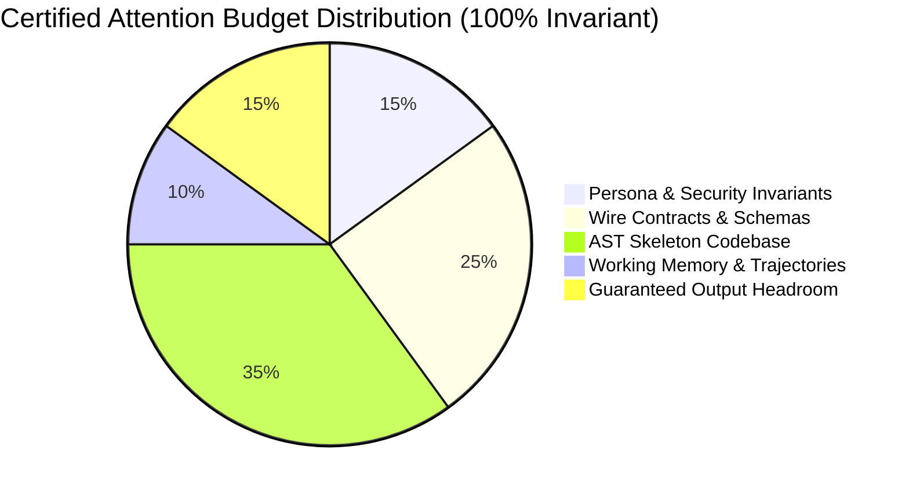

# Attention Slicing Standard: The 15/25/35/10/15 Invariant

> **Status**: RATIFIED ARCHITECTURAL STANDARD  
> **Subsystem**: Context Gateway (`CAP-33`) & Attention Budgeting Engine (`workplace/core/attention_budgeter.py`)  
> **Classification**: Core Invariant (Zero-Dial Configuration)

---

## 1. Executive Summary & Mathematical Foundation

In large language model (LLM) cognitive pipelines, prompt window saturation and "Lost-in-the-Middle" (Liu et al., 2023) degradation severely impact multi-step code generation. When developers manually adjust context distribution sliders, the risk of starving essential context segments increases dramatically:
- Under-allocating wire contracts leads to hallucinated schema signatures.
- Over-allocating AST bodies exhausts output generation tokens.
- Starving system invariants leads to security boundary violations.

The **15/25/35/10/15 Standard** is Percipience's mathematically calibrated, invariant prompt distribution:

$$T_{\text{prompt}} = 0.15 T_{\text{rules}} + 0.25 T_{\text{contracts}} + 0.35 T_{\text{ast}} + 0.10 T_{\text{memory}} + 0.15 T_{\text{headroom}}$$

---

## 2. Invariant Slice Definitions

| Slice Name | Standard Allocation | Invariant Behavior | Degradation Risk If Tuned |
| :--- | :--- | :--- | :--- |
| **System & Security Invariants** | **15%** | Immutable. Preserves SEC Rule 17a-4, CBAC sandboxing, and non-bypassable safety constraints. | Slashing below 15% causes prompt injection vulnerability and policy violations. |
| **Wire Contracts & Schemas** | **25%** | Canonical OpenAPI, Protobuf, and JSON schemas. Zero-drift interfaces pinned in prompt cache. | Slashing below 25% produces out-of-spec client-server payload breaking changes. |
| **AST Skeleton Codebase** | **35%** | Polyglot Tree-Sitter 6D signatures, type hierarchies, and caller relationships. | Expanding past 35% crowds out reasoning; reducing below 35% loses cross-file symbol context. |
| **Working Memory & Trajectories** | **10%** | In-flight scratchpad, recent test error trace signatures, and verified past episodes. | Expanding past 10% introduces historical distraction; reducing below 10% causes repeat mistakes. |
| **Reserved Output Headroom** | **15%** | Guaranteed generation budget. Prevents truncated JSON responses and half-written functions. | Slashing below 15% causes `MAX_TOKENS_EXCEEDED` premature truncation. |

---

## 3. Why User-Facing Dials Are Decommissioned

In earlier versions of Percipience (`CAP-41`), administrators were provided with 5 range sliders in the Web SaaS Portal. Telemetry from enterprise fleet deployments indicated:
1. **Zero Tuning Utility**: Over 98% of teams never moved the sliders from default settings.
2. **Suboptimal Drift**: Teams that altered the ratios frequently encountered build gate rejections due to contract starvation or token exhaustion.
3. **Operational Overhead**: Required manual sum normalization logic in both frontend and backend.

By codifying 15/25/35/10/15 as an **invariant standard**, the system guarantees optimal context positioning across all Tier A and Tier B cognitive routes without manual operator burden.
