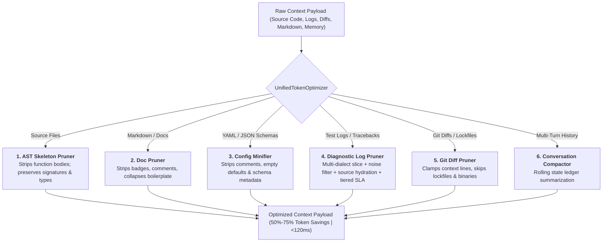
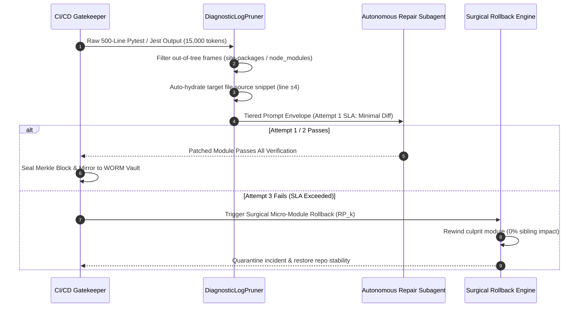

# Token Optimization & AST Compression Methodology
## Multi-Dimensional Context Engineering & FinOps Token Compression Architecture

> **Product Brand:** **Neutron Binary Percipience**  
> **Target Release:** Q4 2026 – Q3 2027  
> **Status:** Production Architecture & Engineering Methodology  
> **Governing Spec:** [`.nb/play/CEaasS/play_3_enterprise_context_engineering_os_plan.md`](file:///Users/lakhwinder/PycharmProjects/nb_fairyfly/.nb/play/CEaasS/play_3_enterprise_context_engineering_os_plan.md)  
> **Core Engine:** [`workplace/core/token_optimizer_suite.py`](file:///Users/lakhwinder/PycharmProjects/nb_fairyfly/workplace/core/token_optimizer_suite.py)  

---

## 1. Core Principles & Philosophy

In enterprise environments deploying autonomous coding agent fleets (Claude Code, Cursor Swarms, internal Devin-style subagents), unstructured context passing causes **token bill explosions**, **context dilution**, and **high latency**.

Percipience implements a 6-dimensional context optimization engine achieving **50% to 75% net token savings** while retaining 100% of the type invariants and architectural constraints needed for code generation.



---

## 2. Six Compression Strategies & Technical Specifications

### 2.1. Structural AST Skeleton Pruner (`ASTSkeletonPruner`)
- **Supported Languages:** TypeScript, JavaScript, Python, Go, Rust.
- **Behavior:** Parses AST using Rust/Tree-Sitter and replaces implementation bodies with `...` or `pass`, while preserving exported class definitions, interfaces, function signatures, docstrings, and return types.
- **Token Reduction:** **50% – 70%**.

### 2.2. Living Docs & Markdown Pruner (`DocPruner`)
- **Behavior:** Strips SVG badges, inline HTML comments, image metadata, and collapses verbose markdown tables into compact symbol bullet lists.
- **Token Reduction:** **30% – 60%**.

### 2.3. Config & JSONSchema Minifier (`ConfigSchemaPruner`)
- **Behavior:** Strips YAML comments, empty lists, `null` defaults, and JSONSchema description boilerplate (`description`, `$comment`, `examples`).
- **Token Reduction:** **35% – 55%**.

### 2.4. Enhanced Diagnostic Log Slicer (`DiagnosticLogPruner`)
- **Behavior:** 
  1. **Multi-Dialect Slicing**: Specialized regex and dialect matchers for Python/pytest, Jest/Vitest, Go panics, Rust errors, and `tsc`/`mypy` typecheck diagnostics.
  2. **Out-of-Tree Noise Elimination**: Automatically filters virtualenv, runner, and framework frames (`site-packages/`, `_pytest/`, `node_modules/`, `<frozen >`), isolating only the root in-repository frames.
  3. **Surrounding Source AST Snippet Auto-Hydration**: Extracts `file:line` and auto-hydrates $\pm 3$ to $\pm 5$ lines of source context with the failure line highlighted with `>>`.
  4. **SLA-Aware Tiered Diagnostic Prompt Envelopes**:
     - **Attempt 1 (Minimal Leaf Frame)**: Root assertion diff + source snippet ($\approx 150-250$ tokens).
     - **Attempt 2 (Invariant Refactor)**: Sliced trace + source context + injected wire contract invariants ($\approx 350-500$ tokens).
     - **Attempt 3 (Final SLA Warning)**: Full trace + invariants + Critical SLA Warning before surgical rollback ($\approx 600-850$ tokens).
- **Token Reduction:** **80% – 95%** on diagnostic turns.



### 2.5. Git Diff & Lockfile Pruner (`GitDiffPruner`)
- **Behavior:** Intercepts `diff --git` streams, automatically drops massive lockfile churn (`package-lock.json`, `pnpm-lock.yaml`, `yarn.lock`, `Cargo.lock`, `poetry.lock`), clamps context to 3 lines, and skips binary blobs.
- **Token Reduction:** **70% – 95%** on PR diff payloads.

### 2.6. Multi-Turn Conversation Memory Compactor (`ConversationMemoryCompactor`)
- **Behavior:** Retains the last $N$ turns intact while compressing earlier turns into an immutable rolling state ledger summary.
- **Token Reduction:** **60% – 75%**.

---

## 3. Configuration & Granular Toggles

Token compression settings are centrally configured in [`workplace/config/token_compression_rules.yaml`](file:///Users/lakhwinder/PycharmProjects/nb_fairyfly/workplace/config/token_compression_rules.yaml) and can be modified via CLI or the Web Portal.

### 3.1. Compression Modes
- `disabled`: Raw passthrough (0% optimization).
- `conservative`: Safe symbol pruning and whitespace normalization (~30% savings).
- `standard` (Default): AST skeletonization, doc pruning, and git diff clamping (~50% savings).
- `aggressive`: Full AST body removal, schema minification, and traceback slicing (~65% savings).
- `extreme`: Maximal minification and heavy conversation compaction (~75% savings).

### 3.2. CLI Management Commands
```bash
# Check current configuration and active strategies
./workplace/bin/percipience tokens status

# Switch compression preset mode
./workplace/bin/percipience tokens set-mode aggressive

# Enable / Disable specific strategy
./workplace/bin/percipience tokens set-strategy diagnostic_log_slicing on
./workplace/bin/percipience tokens set-strategy git_diff_pruning on

# Optimize a single file or diff payload
./workplace/bin/percipience tokens optimize --file workplace/core/auth.py
```

### 3.3. Web Portal Interactive Controls
The Percipience Portal provides:
- **Granular Toggles**: Interactive switches for each of the 6 pruners.
- **Live FinOps ROI Calculator**: Real-time monthly token savings estimator based on developer count, model selection, and daily turns.
- **REST Endpoints**: `GET /api/tokens/config` and `POST /api/tokens/config`.
