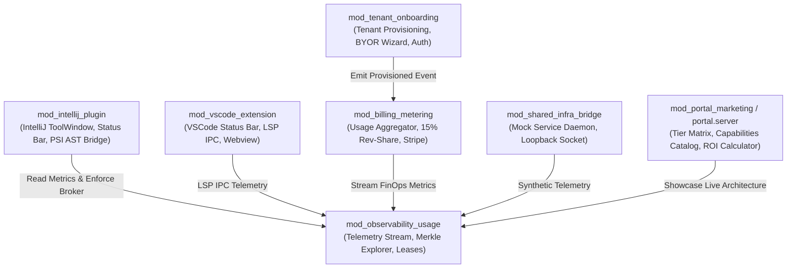

# Poly-Module Interface Catalog & Responsibilities

> **Autonomously Synchronized**: 2026-09-19T16:00:00+00:00  
> **Engine**: `agent_living_doc_architect` (CAP-21)  
> **Diagram Validation**: ✅ Valid Mermaid

## Module Dependency Graph

## Public Interface Catalog
| Module Name | Responsibilities | Public Interfaces / Symbols | Wire Contract Binding |
| :--- | :--- | :--- | :--- |
| `mod_intellij_plugin` | Native Kotlin IntelliJ/PyCharm plugin; Swing-safe ToolWindow (5 tabs), status bar widget, PSI AST traversal (&lt;35ms), `SandboxPermissionBroker`, `WorkspaceBootstrapper` | `PercipienceToolWindowFactory`, `PercipienceStatusBarWidgetFactory`, `WorkspaceBootstrapper`, `SandboxPermissionBroker`, `PsiAstBridge` | `.nb/context/contracts/sandbox_permission_contract.json` |
| `mod_vscode_extension` | TypeScript VSCode extension; status bar metrics, virtual LSP IPC host, webview RPC bridge | `activate()`, `statusBarManager`, `MockVsCodeIpcHost`, `VirtualLspFixture` | `.nb/context/contracts/sandbox_permission_contract.json` |
| `mod_tenant_onboarding` | Multi-tenant organization provisioning, BYOR VCS binding (GitHub/GitLab/Bitbucket), OAuth2 auth | `provisionTenant()`, `generateByorManifest()`, `authenticateRequest()` | `context/contracts/onboarding_contract.yaml` |
| `mod_billing_metering` | Real-time AST token savings tracking, gross savings conversion ($0.003/1K tokens), 15% performance fee calculation | `aggregateTenantUsage()`, `calculatePerformanceFee()`, `createStripeInvoice()` | `context/contracts/billing_meter_contract.yaml` |
| `mod_observability_usage` | Live Merkle block DAG explorer, ephemeral worktree lease monitor, append-only quarantine console, OpenTelemetry GenAI W3C traces | `streamTelemetry()`, `getMerkleNode()`, `listActiveLeases()`, `getQuarantineEntries()` | `context/contracts/observability_contract.yaml` |
| `mod_shared_infra_bridge` | Zero-dependency virtual service loopback bridge, async socket emulator, synthetic telemetry stream | `initBridge()`, `dispatchMockRequest()`, `simulateTelemetryEvent()` | `context/contracts/service_contract.yaml` |
| `mod_portal_marketing` / `portal.server` | Enterprise interactive capabilities catalog, Plan Tier Matrix & Boundary Ceilings (Section 2), 4-way competitive matrix, real-time ROI calculator, Context Gateway, Secure Client Space | `renderCapabilities()`, `calculateFinOpsROI()`, `renderCompetitiveMatrix()`, `calculateCeilings()` | None (Frontend Client & Gateway View) |
