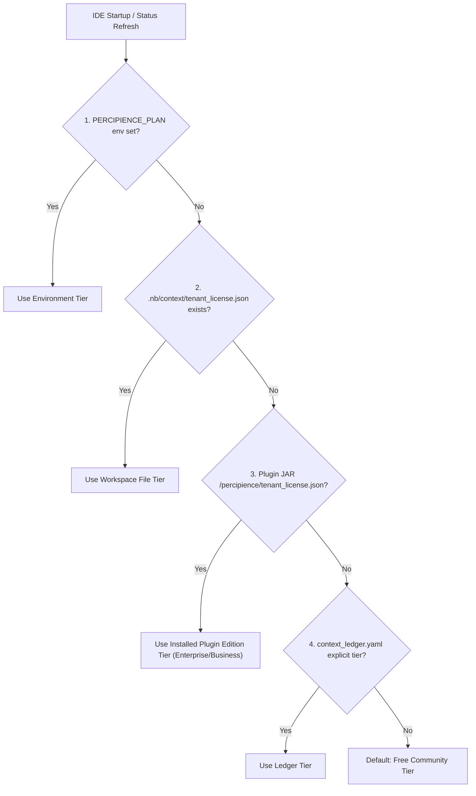
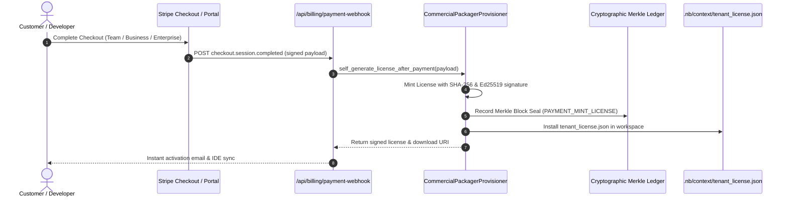

# Commercial License Management & Post-Payment Self-Generation Architecture

**Document ID:** `PROP-LIC-001`  
**Status:** Approved & Implemented  
**Date:** 2026-10-08  
**Scope:** Multi-Tier License Minting, Admin Portal Widget, IDE License Resolution, and Post-Payment Self-Generation Engine  

---

## 1. Executive Summary

Percipience implements a commercial pricing model spanning four tiers:
1. **Free Community Tier (`plan_free`)**: 1 Seat, 1 Worktree, 500 Audits/mo, local AST pruning and Merkle core.
2. **Team Tier (`plan_team`)**: 15 Seats, 5 Worktrees, 5,000 Audits/mo, custom agent creation and worktree leases.
3. **Business Tier (`plan_business`)**: 50 Seats, 20 Worktrees, 25,000 Audits/mo, NBPack layer compilation and full platform tool APIs.
4. **Enterprise Dedicated (`plan_enterprise`)**: Unlimited Seats, Unlimited Worktrees, Unlimited Audits, Private VPC enclaves, WORM cloud egress, and Swarm Triad orchestration.

This document establishes the architecture for:
- Standalone cryptographic license generation and signing (`tenant_license.json` / `PERCIPIENCE_LICENSE.json`).
- Immediate installation into workspace environments (`.nb/context/tenant_license.json`).
- Dynamic Classpath vs. Workspace resolution in IntelliJ IDEA and VS Code plugins.
- Interactive operator widget in the Admin Portal.
- **Automated Self-Generation of licenses following payment completion** (e.g., Stripe checkout webhook integration).

---

## 2. Cryptographic License Specification

A Percipience license is an immutable, canonical JSON document signed with SHA-256 and Ed25519:

```json
{
  "license_id": "lic_plan_enterprise_8f12a9bc34e0",
  "tenant_id": "tenant_acme_fintech",
  "tenant_name": "Acme Global Financial Technologies",
  "tier": "plan_enterprise",
  "tier_name": "Enterprise Dedicated Tier",
  "base_price_monthly_usd": 9999,
  "included_seats": -1,
  "included_concurrent_worktrees": -1,
  "included_pr_audits_monthly": -1,
  "entitled_features": {
    "ast_token_pruning": true,
    "merkle_chain_audit": true,
    "basic_autonomous_cicd": true,
    "platform_core_encryption": true,
    "nbpack_obfuscation": true,
    "user_plan_encryption": true,
    "basic_platform_tools_exposure": true,
    "private_vpc_deploy": true,
    "dedicated_slack_sla": true
  },
  "payment_reference": "pi_3NqXyZ2eZvKYlo2C1g9ABCDE",
  "issued_at": "2026-10-08T16:30:00.000000+00:00",
  "expires_at": null,
  "signature_sha256": "4b6c...99e1"
}
```

---

## 3. License Resolution Hierarchy in IDE Plugins

To prevent hardcoded development resources from poisoning runtime environments, the IDE plugin resolves licenses in strict precedence:



1. **Environment Variable (`PERCIPIENCE_PLAN`)**: Operator override.
2. **Active Workspace License (`.nb/context/tenant_license.json`)**: Installed project license.
3. **Embedded Plugin JAR License (`/percipience/tenant_license.json`)**: Installed plugin edition baseline (Enterprise, Business, or Team JAR).
4. **Merkle Ledger Tier (`context_ledger.yaml`)**: Cryptographic state ledger.
5. **Fallback (`plan_free`)**: Base unauthenticated tier.

---

## 4. Post-Payment Self-Generation Pipeline (Pending / Planned Architecture)

When customers purchase a subscription via Stripe or customer portals, licenses are minted automatically via an idempotent payment fulfillment hook:



### Self-Generation Invariants:
- **Idempotency:** Re-delivered payment webhooks return existing signed license matching `payment_reference`.
- **Zero Human Gate:** Licenses are signed within < 50ms and ready for instant download or automatic installation.
- **Auditability:** Every self-generated license is sealed into `context_ledger.yaml` with transaction hashes.
