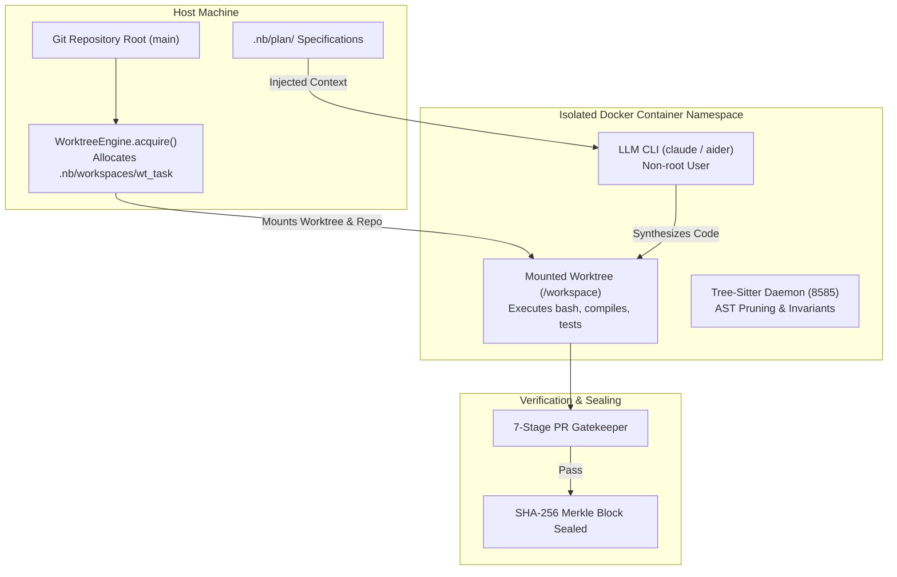
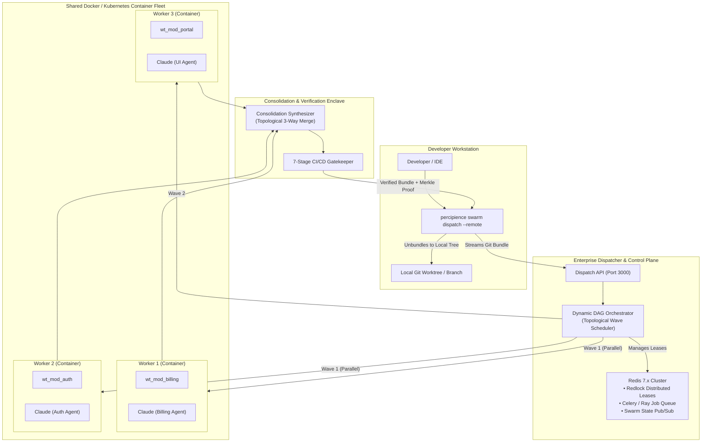

# RFC: Sandboxed Worktree Plan Derivation & Distributed Multi-Container Swarm Fleets

> **RFC Status:** Draft / Under Review  
> **Date:** 2026-10-06  
> **Target Release:** Percipience Enterprise (Q4 2026 – Q1 2027)  
> **Related Specifications:** [`.nb/plan/master/parent-master-free-plan/detailed.md`](file:///Users/lakhwinder/PycharmProjects/nb_fairyfly/.nb/plan/master/parent-master-free-plan/detailed.md) (Section 17.1), [`workplace/infra/docker/`](file:///Users/lakhwinder/PycharmProjects/nb_fairyfly/workplace/infra/docker/)  
> **Purpose:** Blueprint for deriving actionable items in [`TODO.md`](file:///Users/lakhwinder/PycharmProjects/nb_fairyfly/TODO.md) to enable sandboxed single-container worktree derivation and distributed multi-container enterprise swarm fleets.

---

## 1. Executive Summary

As enterprise organizations scale the usage of autonomous coding agents (Claude Code CLI, Aider, Gemini CLI, Cursor agents), two critical requirements emerge:

1. **Local Sandboxed Plan Derivation (Single Node):** Developers need to run an LLM CLI inside an isolated Docker container on a dedicated Git worktree to derive code from `.nb/plan/` specifications without polluting their active working directory or granting the model unrestricted access to the host machine.
2. **Distributed Ephemeral Worktree Swarms (Multi-Container Fleet):** Multiple developers submitting large, computationally expensive feature derivations must be able to offload the work to a shared enterprise fleet of Docker containers. Each container executes a subagent on an isolated Git worktree, the orchestrator consolidates the parallel derivations via topological 3-way merges and CI gate verification, and the validated result is streamed back to the developer's local machine.

---

## 2. Topic 1: Sandboxed Plan Derivation on Worktrees in Docker

### 2.1. Architectural Topology



### 2.2. Core Design Invariants
1. **Defense-in-Depth Isolation**:
   - **Filesystem Level:** Ephemeral Git worktree (`.nb/workspaces/wt_<task_id>`) isolates branches, preventing dirty clobbering of `main`.
   - **Process & OS Level:** Docker container encapsulates shell execution, preventing malicious or accidental access to host SSH keys, system files, or host daemons.
2. **Git Worktree Pointer Handling in Docker**:
   - In Git, `.nb/workspaces/wt_<task_id>/.git` is a pointer text file referencing `<repo_root>/.git/worktrees/...`.
   - To ensure `git` commands work seamlessly inside the container, mount the repository root read-only at `/repo:ro` and the specific worktree at `/workspace:rw`, or mount the repository root at `/workspace` and execute `git worktree add` from within the container.
3. **Plan-Driven Prompt Injection**:
   - The LLM CLI is invoked with a pointer to the governing plan specification (e.g., `.nb/plan/master/parent-master-free-plan/detailed.md`).
   - Claude Code CLI automatically ingests `.percipience_claude_context.md` (or symlinked `CLAUDE.md`) to enforce project invariants.
4. **Pre-Merge Verification Gate**:
   - Before any code from the worktree is merged back into `main`, `./.nb/bin/percipience gate` executes inside the container to verify AST complexity, contract backward-compatibility, and test suite pass rates.

---

## 3. Topic 2: Distributed Ephemeral Worktree Swarms (DEWS) Fleet

### 3.1. Enterprise Fleet Architecture



### 3.2. Core Design Invariants

#### 1. Zero-Cloud-Clutter Git Bundle Transport
- Instead of polluting the central corporate repository with hundreds of ephemeral branches, the developer's CLI creates an encrypted Git bundle of uncommitted changes:
  ```bash
  git bundle create /tmp/dispatch_task.bundle HEAD~1..HEAD
  ```
- The dispatch payload contains the Git bundle, the target plan reference, and an HMAC authentication token.
- When remote derivation succeeds, the fleet returns a consolidated Git bundle which the user's CLI extracts directly into their local worktree (`git bundle unbundle`).

#### 2. Distributed Worktree Leasing via Redis Redlock
- Shared container fleets mount a bare repository over high-performance storage.
- Each worker container acquires an ephemeral worktree via `WorktreeEngine.acquire(..., use_redis=True)` with a time-bounded lease (TTL).
- If a worker container crashes or times out, the lease expires and is reclaimed automatically without leaving dead file locks.

#### 3. Topological Wave Scheduling
- `DynamicDAGOrchestrator` organizes multi-agent tasks into parallel waves.
- Dependent modules wait until upstream interface contracts and DTO schemas are generated and verified.
- Concurrency limiters (`max_concurrency`) prevent rate-limiting against upstream LLM provider APIs (Anthropic, OpenAI, Vertex AI).

#### 4. Disjoint Module Scoping & Semantic 3-Way Merge
- Monorepo modules are assigned disjoint write boundaries (Worker 1 $\rightarrow$ `mod_billing`, Worker 2 $\rightarrow$ `mod_auth`).
- Shared wire contracts in `.nb/context/contracts/` prevent API divergence.
- The **Consolidation Synthesizer Agent** executes a 3-way semantic merge, repairing minor integration seam conflicts before running the 7-stage gatekeeper.

---

## 4. Candidate TODO Items for Engineering Implementation

Below are the drafted backlog items designed to be reviewed and incorporated into [`TODO.md`](file:///Users/lakhwinder/PycharmProjects/nb_fairyfly/TODO.md):

### `TODO-DEWS-01`: Docker Agent Runner Base Image & Tooling Manifest
* **Component:** `workplace/infra/docker/Dockerfile.agent_runner`, `workplace/infra/docker/entrypoint_agent.sh`
* **Description:** Create a standardized, hardened multi-runtime Docker image equipped with Python 3.11, Node.js 20, Git, jq, curl, `@anthropic-ai/claude-code`, and `aider-chat`. Include non-root execution permissions, global git identity defaults, and dynamic safe-directory configuration.
* **Acceptance Criteria:** Image builds cleanly under 800MB; `claude --version` and `aider --version` execute successfully inside container; non-root user cannot access root filesystem.

### `TODO-DEWS-02`: Containerized Plan-to-Code Executor Engine
* **Component:** `.nb/core/container_plan_executor.py`, `.nb/bin/percipience swarm exec`
* **Description:** Implement an execution harness that takes a plan path and target module, acquires an ephemeral worktree via `WorktreeEngine.acquire()`, mounts the worktree into `percipience/agent-runner`, and drives the LLM CLI in headless mode (`-p` / `--print`) to implement the specification.
* **Acceptance Criteria:** Automatically mounts worktree without `.git` pointer breakage; runs unit tests inside container; cleans up container upon exit.

### `TODO-DEWS-03`: Streaming Git Bundle Transport Module
* **Component:** `.nb/core/git_bundle_transport.py`
* **Description:** Implement cryptographic packaging and extraction of Git commits and uncommitted diffs using `git bundle create` and `git bundle verify`. Provide streaming HTTP upload/download adapters to transmit state between developer workstations and remote fleets without polluting remote Git branches.
* **Acceptance Criteria:** Round-trip test: local uncommitted branch $\rightarrow$ bundle $\rightarrow$ remote extraction $\rightarrow$ remote commit $\rightarrow$ result bundle $\rightarrow$ local merge passes with 100% hash parity.

### `TODO-DEWS-04`: Enterprise Swarm Fleet Dispatch API & Endpoints
* **Component:** `workplace/portal/server.py`, `.nb/core/swarm_fleet_dispatcher.py`
* **Description:** Add REST endpoints under `/api/swarm/fleet/*` (`POST /api/swarm/fleet/dispatch`, `GET /api/swarm/fleet/jobs/{job_id}`, `GET /api/swarm/fleet/jobs/{job_id}/bundle`) supporting asynchronous task ingestion, worker allocation, and streaming results.
* **Acceptance Criteria:** Authenticated multipart upload accepts bundles; returns task execution receipt; provides live WebSocket / SSE job status updates.

### `TODO-DEWS-05`: Distributed Worktree Coordinator with Live Redis 7.x Redlock
* **Component:** `.nb/core/worktree_engine.py` (upgrade `RedisRedlockBackend`)
* **Description:** Enhance `RedisRedlockBackend` with real `redis-py` connection pooling, distributed lease renewal heartbeats, and cluster quorum verification for multi-node deployments.
* **Acceptance Criteria:** Concurrent worktree requests across 5 containers correctly serialize; dead container lease auto-evicts within TTL window.

### `TODO-DEWS-06`: Topological Consolidation & 3-Way Merge Agent Plugin
* **Component:** `.nb/agentic/custom/agents/agent_consolidation_synthesizer.yaml`, `.nb/core/consolidation_synthesizer.py`
* **Description:** Implement a specialist agent that takes $N$ completed worker branches, performs topological 3-way merges into an integration worktree, verifies wire contracts, and resolves non-conflicting seam differences before triggering the PR Gatekeeper.
* **Acceptance Criteria:** Merges 3 disjoint module branches with 0 human intervention; rejects breaking contract divergences with actionable diagnostics.

### `TODO-DEWS-07`: Percipience CLI Remote Dispatch Subcommand
* **Component:** `.nb/bundles/package_plan_business/bin/percipience`, `.nb/bin/percipience`
* **Description:** Add `./.nb/bin/percipience swarm dispatch --remote <fleet-url> --plan <path> --sync-back <target-wt>` to wrap bundle creation, API dispatch, progress polling, and local unbundle checkout into a seamless developer command.
* **Acceptance Criteria:** Single CLI command dispatches local plan, displays live remote container wave progress in terminal, and checks out verified code locally.

### `TODO-DEWS-08`: Portal Fleet Telemetry & Swarm Dashboard Tab
* **Component:** `workplace/portal/server.py` (`#swarm-fleet`)
* **Description:** Add a live Fleet Monitoring UI in the Portal displaying active worker container slots, Redis Redlock leases, active wave DAG executions, and cumulative FinOps token burn.
* **Acceptance Criteria:** Live visual dashboard updating every 2s via `/api/swarm/fleet/status`; shows per-worker CPU/memory/token metrics.

---

## 5. Next Steps
- [ ] Review RFC specifications and candidate backlog items.
- [ ] Incorporate approved items (`TODO-DEWS-01` through `TODO-DEWS-08`) into [`TODO.md`](file:///Users/lakhwinder/PycharmProjects/nb_fairyfly/TODO.md).
- [ ] Implement Phase 1: `Dockerfile.agent_runner` and local worktree executor (`TODO-DEWS-01`, `TODO-DEWS-02`).
