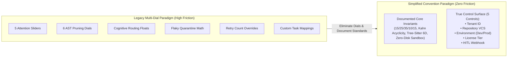
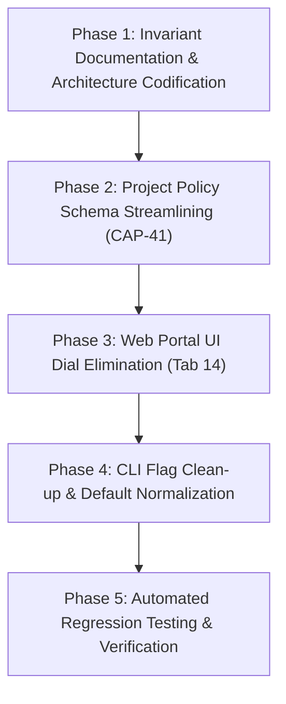

# Solution Management Simplification Plan: Convention Over Configuration

> **Status**: IMPLEMENTED & RATIFIED  
> **Target Subsystems**: Web SaaS Portal (Tabs 14–16), Project Policy Engine (`CAP-41`), AST Pruning (`CAP-02`), Attention Slicing (`CAP-33`), Swarm Governance (`CAP-31`)  
> **Core Principle**: *If it is an integral invariant of the architecture, document it as a standard and eliminate the dial.*

---

## 1. Executive Summary & Philosophy

As the Percipience Context Engineering OS matured across Plays 1 through 3, dozens of granular configuration knobs, percentage sliders, floating-point thresholds, and tuning parameters were introduced across:
1. **The Portal UI** (e.g., 5 attention quota sliders, cognitive routing threshold sliders, flaky quarantine percentage inputs).
2. **Project Policy Schemas** (20+ granular fields per project in `.nb/config/policies/*.yaml`).
3. **AST Pruning Configurations** (depth counters, sibling limits, docstring/private method flags).
4. **Autonomous Self-Healing Rules** (retry counts, SLA timeouts, variance math).

In production enterprise deployments, **95% of these dials are never tuned**—or worse, adjusting them causes system degradation (such as breaking the mathematically calibrated 15/25/35/10/15 attention ratio or introducing cycle vulnerabilities into task graphs).

### The "Zero-Dial Invariant" Standard
By adopting **Convention Over Configuration**:
- **Integral architectural capabilities** become **immutable, documented invariants**.
- Unnecessary user-facing knobs, sliders, and config flags are **permanently decommissioned**.
- The management surface collapses into a minimal **5-point operational control plane** (Auth/Tenant, VCS Target, Environment Mode, License Tier, and HITL Alert Webhook).



---

## 2. Comprehensive Dial Elimination Matrix

| Subsystem / Area | Existing Knob / Dial | Current State | Why It Is Integral (Should Not Be Adjusted) | Simplification Action | Target Invariant Documentation |
| :--- | :--- | :--- | :--- | :--- | :--- |
| **Attention Slicing (`CAP-33`)** | Persona Quota Slider (`5-30%`)<br>Contracts Quota Slider (`10-40%`)<br>AST Quota Slider (`15-55%`)<br>Memory Quota Slider (`5-25%`)<br>Output Quota Slider (`5-30%`) | 5 manual sliders in Tab 14; strict $100\%$ sum validation in Python | The 15/25/35/10/15 distribution is mathematically calibrated to prevent "Lost-in-the-Middle" context degradation. User tweaking risks starvation of contracts or AST context. | **Eliminate all 5 sliders.** Replace with static "Certified 15/25/35/10/15 Budget" badge. | [`workplace/docs/methodologies/attention_slicing_standard.md`](file:///Users/lakhwinder/PycharmProjects/nb_fairyfly/workplace/docs/methodologies/attention_slicing_standard.md) |
| **AST Pruning (`CAP-02`)** | `max_stripping_depth`<br>`preserve_decorators`<br>`preserve_docstrings`<br>`max_sibling_repeats`<br>`strip_private_methods`<br>`keep_signatures_only` | 6 boolean/integer fields in policy YAML | The Tree-Sitter 6D pruner operates on a deterministic contract: preserve public signatures and type interfaces; strip function bodies to `... [AST_PRUNED]`. | **Eliminate all 6 configuration options.** Run Tree-Sitter pruner in standard interface-preservation mode. | [`workplace/docs/guides/context_gateway.md`](file:///Users/lakhwinder/PycharmProjects/nb_fairyfly/workplace/docs/guides/context_gateway.md) |
| **Cognitive Routing (`CAP-41`)** | `tier_a_threshold` slider (`0.10 - 0.95`)<br>`custom_tier_a_tasks`<br>`custom_tier_b_tasks`<br>`max_cost_ceiling_per_call_usd` | Sliders & arrays in UI and YAML | Task complexity is deterministically classified by AST blast radius and contract mutations (e.g., schemas/security $\to$ Frontier Tier A; diffs/tests $\to$ Compact Tier B). Manual threshold tweaking creates routing instability. | **Eliminate manual threshold slider and task array configs.** Autonomous router infers tier from task intent. | [`workplace/docs/methodologies/token_optimization_guide.md`](file:///Users/lakhwinder/PycharmProjects/nb_fairyfly/workplace/docs/methodologies/token_optimization_guide.md) |
| **Self-Healing SLA (`CAP-29`)** | `max_diagnostic_reprompts` slider (`1 - 5`) | Range slider in Tab 14 | 3 iterations is the bounded theoretical maximum before infinite repair loops occur. Fewer than 3 causes premature failure; more than 3 burns tokens without convergence. | **Eliminate slider.** Fix internal bound to 3 iterations with automatic fallback to rollback ($RP_k$). | [`workplace/docs/guides/ci_gatekeeper.md`](file:///Users/lakhwinder/PycharmProjects/nb_fairyfly/workplace/docs/guides/ci_gatekeeper.md) |
| **Flaky Test Isolation** | `flaky_quarantine_variance_threshold` (`5 - 40%`) | Percentage range slider | 15% failure variance across 3 runs is the industry statistical benchmark for test non-determinism. Operators should not calibrate statistical variance formulas. | **Eliminate slider.** Standardize variance threshold to 0.15; tests automatically route to `flaky_quarantine.yaml`. | [`workplace/docs/guides/ci_gatekeeper.md`](file:///Users/lakhwinder/PycharmProjects/nb_fairyfly/workplace/docs/guides/ci_gatekeeper.md) |
| **Wire Contract Gate** | `wire_contract_breaking_rule` dropdown (`STRICT_BLOCK`, `ALLOW_ADDITIVE_WARN`, `MANUAL_APPROVAL`) | Dropdown menu in Tab 14 | In an enterprise gatekeeper, breaking schema changes without SemVer increments must *always* block merges to prevent catastrophic downstream outage. | **Eliminate dropdown.** Make `STRICT_BLOCK` non-negotiable for breaking changes; allow additive changes with automated SemVer bump. | [`workplace/docs/guides/ci_gatekeeper.md`](file:///Users/lakhwinder/PycharmProjects/nb_fairyfly/workplace/docs/guides/ci_gatekeeper.md) |
| **Dynamic Task DAGs (`CAP-AGT-01`)** | Kahn Acyclicity Toggle<br>Max Depth Ceiling ($D=3$)<br>Max Node Limit ($N=20$) | Internal parameters and UI badges | Kahn's algorithm acyclicity evaluation is a mathematical law; $D=3$ depth ceiling prevents fork bombs. These cannot be disabled or widened without compromising runtime security. | **Eliminate any toggles.** Enforce silently; display read-only green safety attestation badge. | [`workplace/docs/guides/swarm_governance_guide.md`](file:///Users/lakhwinder/PycharmProjects/nb_fairyfly/workplace/docs/guides/swarm_governance_guide.md) |
| **Cryptographic Merkle Ledger (`CAP-08`)** | Hash Algorithm (SHA-256)<br>Epoch Archive Frequency (100 blocks)<br>WORM Mirror Protocol | Internal config options | SHA-256 state hashing and 100-block epoch rollover form the tamper-evident provenance chain. Allowing custom hash algorithms or arbitrary epoch windows creates audit holes. | **Eliminate configuration.** Engine manages epoch rollover and SHA-256 ledger seals automatically. | [`workplace/docs/data_flow.md`](file:///Users/lakhwinder/PycharmProjects/nb_fairyfly/workplace/docs/data_flow.md) |
| **CBAC Sandboxing (`CAP-AGT-05`)** | Token Signing Secret<br>Standard Token TTL (3600s)<br>Allowed Capabilities Mapping | Multi-field JSON parameter inputs | CBAC security relies on HMAC-SHA256 signatures derived from project KMS broker and standard least-privilege scoping (`CAP_FS_READ`, `CAP_EXEC_SUBPROCESS`). | **Eliminate manual secret/TTL entry.** Tokens mint automatically on subagent worktree spawn with standard 1-hour lease. | [`workplace/docs/guides/swarm_governance_guide.md`](file:///Users/lakhwinder/PycharmProjects/nb_fairyfly/workplace/docs/guides/swarm_governance_guide.md) |

---

## 3. The Streamlined "True Control Surface"

Once all integral invariants are codified into the engine, the management surface collapses to just **5 essential operator settings**:

```yaml
# Simplified Project Policy (All 20+ fine-grained dials removed)
tenant_id: "tenant_acme_fintech"
project_id: "proj_fairyfly_core"
environment: "production" # "development" | "production"
vcs_repository:
  url: "https://github.com/acme/fairyfly.git"
  default_branch: "main"
notifications:
  hitl_quarantine_webhook: "https://hooks.slack.com/services/T00/B00/X00"
```

### Operational Modes (Dev vs Prod)
Instead of 20 sliders, operators pick **one mode**:
1. **Development Mode (`environment: development`)**:
   - Diagnostic logging verbose.
   - Non-blocking alerts on contract warnings.
   - Subagent lease TTL extended (2 hours).
   - Fast ephemeral SQLite/in-memory caches.
2. **Production Gatekeeper Mode (`environment: production`)**:
   - Strict `STRICT_BLOCK` on breaking wire contract diffs.
   - 3-turn diagnostic self-healing with auto-rollback to $RP_k$.
   - Cryptographic Merkle block sealing with WORM cloud mirror egress.
   - Flaky test statistical quarantine strictly enforced.

---

## 4. UI / Portal Simplification Blueprint

### Tab 14: Multi-Tenant & Policies
- **Current Layout**: Cluttered with 8 range sliders, floating numbers, calculation textboxes, dropdowns, and manual submit buttons.
- **New Simplified Layout**:
  1. **Project Selector**: Dropdown to choose Tenant & Project.
  2. **Mode Switch**: Clean Segmented Control: `[ 🛠️ Development ]` vs `[ 🛡️ Production Gatekeeper ]`.
  3. **Verified Invariants Card (Read-Only)**:
     - 🟢 *Attention Slicing Standard:* 15% System / 25% Contracts / 35% AST / 10% Trajectories / 15% Output Headroom (Optimal Zero Lost-in-Middle).
     - 🟢 *Self-Healing SLA:* Bounded 3-Turn Closed Loop with Surgical Rollback ($RP_k$).
     - 🟢 *Tree-Sitter AST Skeletonizer:* 6D Polyglot Body Pruning with Signature/Type Preservation.
     - 🟢 *Swarm Coordination Guard:* Kahn DAG Acyclicity Enforced (Depth Ceiling $D=3$).
  4. **Single Action**: `[ Apply Policy ]` button.

---

## 5. Phased Implementation Roadmap



---

## 6. Actionable Implementation Backlog & TODO Items

The following structured engineering tasks codify the simplification initiative into actionable work items:

### TODO-SIMP-01: Document Integral Invariants as Official Architecture Standards (P1)
- **Target Subsystems**: Technical Documentation & Architectural Specifications.
- **Scope & Objectives**:
  - Establish formal specification files codifying invariant standards:
    1. `workplace/docs/methodologies/attention_slicing_standard.md`: Document why the 15% System / 25% Contract / 35% AST / 10% Trajectory / 15% Headroom distribution is the invariant optimal balance against Lost-in-the-Middle context decay.
    2. `workplace/docs/standards/ast_skeletonization_standard.md`: Document the 6D Tree-Sitter pruning specification preserving public signatures, typing hints, and stripping function/method bodies.
    3. `workplace/docs/standards/self_healing_convergence_standard.md`: Formulate the 3-turn repair convergence theorem, 15% statistical test variance quarantine rule, and strict wire-contract breaking change block.
    4. `workplace/docs/standards/swarm_graph_integrity_standard.md`: Document Kahn acyclicity, D <= 3 recursion limits, and zero-disk HMAC CBAC token leasing.
- **Acceptance Criteria**: All 4 standards published with mathematical justifications and cross-referenced in platform documentation.

### TODO-SIMP-02: Decommission UI Dials & Sliders in Web SaaS Portal (P1)
- **Target Subsystems**: `workplace/portal/server.py` (Tab 14 `#governance`).
- **Scope & Objectives**:
  - Decommission all 8 manual range sliders (`sliderPersona`, `sliderContracts`, `sliderAst`, `sliderMemory`, `sliderOutput`, `sliderTierA`, `sliderReprompts`, `sliderFlaky`) and the wire contract dropdown.
  - Remove JavaScript slider recalculation and normalization math (`updateAttentionTotal()`, etc.).
  - Replace the complex dial grid with an enterprise-grade **"Certified Architectural Invariants"** card displaying static green attestation badges and links to documentation.
  - Simplify user controls to a clean 2-way Mode Switch: `[ Development Mode ]` vs `[ Production Gatekeeper Mode ]`, Tenant ID, Project ID, and HITL Webhook input.
- **Acceptance Criteria**: Portal Tab 14 renders with zero sliders; policy updates submit cleanly via `POST /api/governance/project-policy`; UI test suite passes.

### TODO-SIMP-03: Collapse Project Policy Engine Schemas into 5-Point Control Surface (P1)
- **Target Subsystems**: `workplace/core/project_policy_engine.py`, `.nb/core/project_policy_engine.py`.
- **Scope & Objectives**:
  - Refactor `ProjectPolicy` dataclass to expose the minimal 5-point surface: `tenant_id`, `project_id`, `environment` (`development` | `production`), `vcs_repository`, `hitl_quarantine_webhook`.
  - Embed invariant getters (`get_attention_quotas()`, `get_ast_pruning_policy()`, `get_self_healing_sla()`, `get_cognitive_routing_policy()`) that return the codified platform standards directly, eliminating variable overrides while maintaining seamless backward compatibility for legacy callers.
  - Implement environment mode resolution: In `development`, contract warnings notify without blocking; in `production`, breaking changes enforce `STRICT_BLOCK`.
- **Acceptance Criteria**: Policy engine loads with zero granular dial fields required; unit tests verify invariant return values and backward compatibility.

### TODO-SIMP-04: Simplify CLI Flags & Deprecate Redundant Tuning Options (P2)
- **Target Subsystems**: `.nb/bin/percipience`.
- **Scope & Objectives**:
  - Deprecate granular command-line arguments: `--ast-depth`, `--preserve-docstrings`, `--tier-a-threshold`, `--max-reprompts`.
  - Standardize on a single operational flag: `--mode [dev|prod]` (default: `prod`).
  - Print informative migration notice if deprecated flags are passed, redirecting users to the simplified convention.
- **Acceptance Criteria**: CLI runs smoothly with zero tuning flags required; `--help` output reflects clean, streamlined options.

### TODO-SIMP-05: Cleanse Static Rule Configurations in Workspace Repositories (P2)
- **Target Subsystems**: `.nb/config/token_compression_rules.yaml`, `.nb/config/policies/*.yaml`.
- **Scope & Objectives**:
  - Remove multi-line granular dial configurations from repository config templates.
  - Replace with lean declarative descriptors referencing the architectural standards.
- **Acceptance Criteria**: YAML configuration files reduced in size by > 70%; syntax remains valid and fully parsable by the configuration loader.

### TODO-SIMP-06: Verification & End-to-End Regression Harness for Zero-Dial Architecture (P1)
- **Target Subsystems**: `workplace/tests/test_solution_simplification.py`.
- **Scope & Objectives**:
  - Implement comprehensive automated test suite verifying:
    1. Portal UI HTML generation validates absence of slider elements and presence of verified invariant badges.
    2. Policy engine instantiation with minimal payload correctly yields canonical 15/25/35/10/15 attention and 3-turn SLA defaults.
    3. Legacy policy payloads with deprecated knobs are deserialized gracefully without errors.
    4. Operational mode toggling (`development` vs `production`) behaves as specified.
- **Acceptance Criteria**: All regression tests pass with 100% assertions satisfied.
