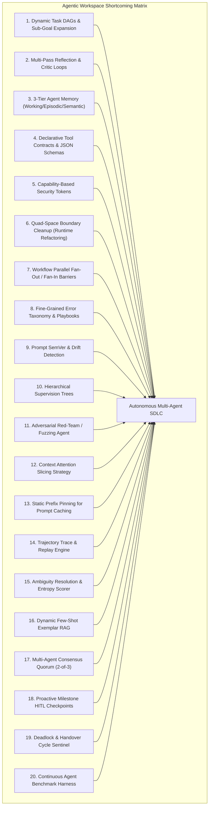

# Autonomous Agentic SDLC Architectural Review & Gap Analysis

> **Document ID:** `PERC-REP-AGENTIC-SDLC-01`  
> **Target Subsystem:** `agentic/` (Workflows, Prompts, Runtime Orchestration, Schemas, Custom Agents)  
> **Audit Date:** 2026-09-17  
> **Status:** COMPREHENSIVE ARCHITECTURAL AUDIT  
> **Governing Standards:** Percipience Quad-Space Architecture, Autonomous SDLC Maturity Model, Anti-Drift Protocol

---

## 1. Executive Summary

A deep architectural and logical review of the `agentic/` workspace was conducted from the perspective of an end-to-end **Autonomous Agentic Software Development Life Cycle (SDLC)**. 

While Percipience possesses industry-leading foundations in **AST token compression**, **Merkle state immutability**, **cryptographic handoff tokens**, and **ephemeral git worktree concurrency**, several architectural gaps, structural drifts, and missing agentic capabilities must be resolved to transition from *deterministic script-orchestrated automation* to *fully autonomous, self-governing, multi-agent cognitive engineering*.

This review identifies **20 critical shortcomings, potential drifts, structural gaps, refactoring needs, and redesign imperatives**, categorizing them into four major pillars:
1. **Agent Coordination, Governance & Swarm Topologies** (Shortcomings 1–5)
2. **Runtime Architecture, Quad-Space Boundaries & Execution Hygiene** (Shortcomings 6–10)
3. **Cognitive Strategy, Attention Budgeting & Prompt Engineering** (Shortcomings 11–15)
4. **Resilience, Evaluation, Consensus & Security Capabilities** (Shortcomings 16–20)

---

## 2. Comprehensive Breakdown of the 20 Shortcomings

### Pillar I: Agent Coordination, Governance & Swarm Topologies

#### 1. Static Linear Workflow DAGs vs. Dynamic Runtime Sub-Goal Expansion (`GAP-AGT-01`)
- **Current Defect:** Workflows in `agentic/workflows/` (`derivation_pipeline.yaml`, `pr_gatekeeper.yaml`) are defined as static, sequential linear lists of steps.
- **SDLC Impact:** Complex software engineering tasks are non-linear. When an unexpected dependency or structural deficiency is discovered during development, the agent cannot dynamically synthesize sub-goals, spawn exploratory sub-plans, or adapt its execution path without human intervention or pipeline failure.
- **Target Redesign:** Implement dynamic DAG execution supporting runtime sub-goal generation (Plan-and-Solve / ReAct loops), conditional branch expansion based on blast-radius analysis, and backtracking.

#### 2. Lack of Structured Multi-Pass Self-Reflection & Critic Feedback Loops (`GAP-AGT-02`)
- **Current Defect:** Prompts in `agentic/prompts/` (e.g. `derivation_prompt.md`, `evaluation_refinement_prompt.md`) execute in a single forward pass without enforcing an internal Generator $\to$ Critic $\to$ Refiner (*Reflexion*) verification cycle.
- **SDLC Impact:** Generative agents emit unverified code or flawed architectural assumptions directly to physical file systems and build gates, increasing token burn and test failure cycles.
- **Target Redesign:** Embed a formal self-reflection protocol into all generation prompts: require the agent to produce a structured critique verifying invariant compliance, edge-case coverage, and contract integrity before generating code.

#### 3. Absence of Persistent Agent Memory Architecture (Working, Episodic & Semantic Memory) (`GAP-AGT-03`)
- **Current Defect:** Agents operate in an entirely stateless fashion across session runs. The flat Merkle ledger stores action records but does not provide an indexed agent memory model.
- **SDLC Impact:** An agent facing a previously solved build issue, flaky test quarantine, or contract discrepancy must rediscover solutions from scratch, wasting cognitive context and tokens.
- **Target Redesign:** Introduce a 3-tier Agent Memory System:
  1. *Working Memory:* Ephemeral context scratchpad within the active worktree.
  2. *Episodic Memory:* Indexed historical run logs, past failures, and successful repair trajectories.
  3. *Semantic Memory:* Vector-indexed codebase architecture, domain rules, and wire contract constraints.

#### 4. Underspecified Tool Schemas & Lack of Declarative Tool Contracts (`GAP-AGT-04`)
- **Current Defect:** Custom agent definitions in `agentic/custom/agents/*.yaml` declare tools as plain string lists (e.g., `tools: [ast_pruner, cve_sentinel]`).
- **SDLC Impact:** No runtime validation of tool input arguments or output schemas; lack of distinction between read-only (idempotent) vs mutating tools; higher rate of agent malformed tool-call exceptions.
- **Target Redesign:** Define formal JSON-Schema / OpenAPI specifications for all agent tools, specifying input parameters, output schemas, mutating side-effects, timeouts, and idempotency guarantees.

#### 5. Missing Capability-Based Security & Fine-Grained Agent Sandbox Boundaries (`GAP-AGT-05`)
- **Current Defect:** Once spawned, agents inherit full execution privileges with no declarative permission or security boundary.
- **SDLC Impact:** A rogue or hallucinating agent could execute arbitrary system commands, write to protected paths outside its module workspace, or perform unauthorized network egress.
- **Target Redesign:** Implement Capability-Based Access Control (CBAC) with cryptographically bound capability tokens (`CAP_FS_READ`, `CAP_FS_WRITE_MODULE_ONLY`, `CAP_NETWORK_EGRESS_OFF`, `CAP_EXEC_SUBPROCESS`) strictly enforced by runtime gateways.

---

### Pillar II: Runtime Architecture, Quad-Space Boundaries & Execution Hygiene

#### 6. Architectural Drift & Code Duplication between `agentic/runtime/` and `.nb/core/` (`GAP-AGT-06`)
- **Current Defect:** Multiple runtime execution modules exist duplicated across both `agentic/runtime/` and `.nb/core/` (e.g. `cognitive_router.py`, `worktree_manager.py`, `token_savings_meter.py`).
- **SDLC Impact:** Violates the fundamental Quad-Space separation of concerns (`agentic/` = declarative prompts, workflows, and manifests; `workplace/` = executable implementations). Creates maintenance divergence and packaging bloat.
- **Target Redesign:** Refactor `agentic/runtime/` to strictly contain declarative orchestration schemas, bindings, and manifest definitions, importing execution engines directly from `.nb/core/`.

#### 7. Lack of Parallel Fan-Out / Fan-In Barrier Synchronization in Workflows (`GAP-AGT-07`)
- **Current Defect:** Workflow engines execute pipeline steps sequentially. Independent tasks (e.g. CVE supply-chain scanning, AST symbol pruning, and style linting) run one after another.
- **SDLC Impact:** Unnecessary latency in PR verification gate execution and resource underutilization during multi-module builds.
- **Target Redesign:** Add `parallel_fan_out` and `fan_in_barrier` constructs to `agentic/workflows/`, allowing concurrent execution of independent verification steps with aggregated status collection.

#### 8. Coarse Failure Handling vs. Structured Error Taxonomy & Adaptive Recovery Playbooks (`GAP-AGT-08`)
- **Current Defect:** Workflows use monolithic, blunt failure triggers (`QUARANTINE_AND_HALT`, `AUTO_HEAL_OR_ROLLBACK`).
- **SDLC Impact:** Minor transient network glitches or formatting issues trigger full rollback or quarantine, while structural contract violations receive the same recovery attempts as simple syntax errors.
- **Target Redesign:** Establish a hierarchical Error Taxonomy (Transient $\to$ Structural $\to$ Invariant $\to$ Hallucinatory) with tailored automated recovery playbooks (jitter retry, prompt mutation, subagent delegation, or HITL escalation).

#### 9. Prompt Versioning, Regression Testing & Prompt Drift Detection (`GAP-AGT-09`)
- **Current Defect:** Prompts in `agentic/prompts/*.md` lack Semantic Versioning (`SemVer`), automated regression benchmark assertions, and drift tracking.
- **SDLC Impact:** Upstream foundation model upgrades or minor prompt text edits can silently degrade generation quality, break JSON output parsing, or increase token usage without detection.
- **Target Redesign:** Introduce `prompt_manifest.yaml` with version pinning (`v1.2.0`), golden evaluation test cases, and automated CI prompt regression scoring.

#### 10. Hierarchical Agent Supervision & Multi-Level Authority Trees (`GAP-AGT-10`)
- **Current Defect:** Agents operate as unconstrained peers without a defined hierarchy of command or escalation chain.
- **SDLC Impact:** Junior worker agents can initiate breaking module changes or trigger gate decisions without architectural review from higher-tier orchestrator agents.
- **Target Redesign:** Implement a formal Authority Tree (Orchestrator/Lead Architect $\to$ Domain Specialist $\to$ Worker $\to$ Gatekeeper Sentinel) with strict permission gates preventing workers from approving their own PRs.

---

### Pillar III: Cognitive Strategy, Attention Budgeting & Prompt Engineering

#### 11. Missing Adversarial Red-Team & Fuzzing Agent in PR Gate (`GAP-AGT-11`)
- **Current Defect:** PR verification relies exclusively on cooperative tests authored by the developing agent.
- **SDLC Impact:** Blindspots, edge-case assumptions, and subtle logic flaws in generated code remain untested and can slip into main branch releases.
- **Target Redesign:** Deploy `agent_adversarial_fuzzer` in the PR Gatekeeper to generate hostile inputs, edge-case mutations, and concurrency race conditions against proposed AST patches.

#### 12. Context Window Budgeting & Structured Attention Slicing Strategy (`GAP-AGT-12`)
- **Current Defect:** Prompts assemble context without fixed token slice allocations, risking context overflow and attention dilution ("lost-in-the-middle" effect).
- **SDLC Impact:** Key invariants or schemas placed in middle positions are ignored by the LLM, causing silent specification violations.
- **Target Redesign:** Define explicit Attention Slicing Budgets:
  - 15% System Persona & Invariants (pinned at top)
  - 25% Wire Contracts & Schemas
  - 35% Sliced Code AST & Signatures
  - 10% Working Memory & Scratchpad
  - 15% Output Buffer

#### 13. Prompt Prefix Pinning & Cache-Aware Context Layout (`GAP-AGT-13`)
- **Current Defect:** Dynamic variables (timestamps, module IDs, transient error traces) are interpolated near the beginning of prompts.
- **SDLC Impact:** Invalidates KV prompt caching (Anthropic Prompt Caching / OpenAI Prefix Caching / Gemini Context Caching), increasing operational inference costs by 50–80%.
- **Target Redesign:** Restructure all prompts in `agentic/prompts/` to enforce Static Prefix Pinning: invariant instructions and system rules strictly at the top, dynamic context and user queries strictly at the bottom.

#### 14. Structured Step-by-Step Trajectory Recording & Replay Engine (`GAP-AGT-14`)
- **Current Defect:** The workspace records final ledger states but discards intermediate reasoning traces, rejected hypotheses, tool outputs, and decision trees.
- **SDLC Impact:** Impossibility of deterministic post-mortem debugging for failed agent runs; lack of high-quality trajectory datasets for model fine-tuning.
- **Target Redesign:** Standardize an Agent Trajectory Format (`agentic/trajectories/`) logging complete ReAct cycles (Thought $\to$ Action $\to$ Observation) with replay capability.

#### 15. Autonomous Requirement Clarification & Ambiguity Resolution Agent (`GAP-AGT-15`)
- **Current Defect:** Requests in `user/inputs/` are formalized based on best-effort heuristics even when specifications are underspecified or conflicting.
- **SDLC Impact:** Agents proceed with guesswork, generating software that adheres to syntax but violates unspoken user requirements.
- **Target Redesign:** Introduce `agent_ambiguity_resolver` to measure requirement entropy, identify missing SLAs, data ranges, or security constraints, and generate targeted RFC clarification questions before code generation starts.

---

### Pillar IV: Resilience, Evaluation, Consensus & Security Capabilities

#### 16. Dynamic Few-Shot Exemplar Selection & Context-Aware RAG Injection (`GAP-AGT-16`)
- **Current Defect:** Prompts are zero-shot or contain static hardcoded code snippets that do not adapt to the specific problem domain.
- **SDLC Impact:** Lower code synthesis accuracy on complex domain tasks (e.g. Stripe webhooks, BLE ring buffers, AST visitors).
- **Target Redesign:** Implement dynamic few-shot retrieval injecting top-$k$ verified code exemplars matching the target language, AST pattern, and domain task.

#### 17. Multi-Agent Consensus & Voting Protocol for Critical Decisions (`GAP-AGT-17`)
- **Current Defect:** Critical pipeline decisions (e.g. security sign-off, schema deprecation, PR gate merge) depend on a single agent persona.
- **SDLC Impact:** Single-agent cognitive blindspots or prompt injection vulnerabilities can compromise the entire codebase.
- **Target Redesign:** Implement a 2-of-3 Multi-Agent Consensus Quorum (evaluating across varied prompt configurations or cognitive tiers) for all Tier-A architectural actions.

#### 18. Proactive Milestone-Based HITL Collaboration vs. Pure Quarantine Fallback (`GAP-AGT-18`)
- **Current Defect:** Human-In-The-Loop (HITL) interaction is treated exclusively as an error trap (`poisoning_quarantine.md`).
- **SDLC Impact:** Missed opportunities for human feedback during architectural planning, trade-off selection, or visual UI approval before downstream code generation.
- **Target Redesign:** Introduce proactive HITL Checkpoints in `agentic/workflows/` with interactive Slack/CLI/Web approval cards for architectural milestones.

#### 19. Deadlock Detection & Cycle Prevention in Inter-Agent Handoffs (`GAP-AGT-19`)
- **Current Defect:** `handoff_schema.yaml` validates message payloads but provides no runtime protection against circular handoff loops (Agent A $\to$ Agent B $\to$ Agent A).
- **SDLC Impact:** Risk of infinite recursive token burn and workflow deadlocks during complex multi-agent handoffs.
- **Target Redesign:** Implement a Swarm Graph Cycle Sentinel enforcing max hop TTL ($TTL = 5$) and topological loop detection in `.nb/core/handoff_validator.py`.

#### 20. Automated Agent Benchmark & Continuous Quality Evaluation Harness (`GAP-AGT-20`)
- **Current Defect:** Custom agents in `agentic/custom/agents/` are evaluated ad-hoc without standardized benchmark suites.
- **SDLC Impact:** No objective measurement of agent task success rate, latency, token spend, or regression across workspace updates.
- **Target Redesign:** Build an automated Agent Evaluation Harness (`workplace/tests/benchmarks/test_agent_benchmarks.py`) testing agents against synthetic challenge sets with automated Merkle scorecard reporting.

---

## 3. Prioritized Implementation Roadmap

| Shortcoming ID | Subsystem | Title | Priority | Target Milestone |
| :--- | :--- | :--- | :---: | :---: |
| **GAP-AGT-01** | Workflows | Dynamic Task DAGs & Runtime Sub-Goal Expansion | **P1** | Sprint 1 |
| **GAP-AGT-02** | Prompts | Multi-Pass Self-Reflection & Critic Verification Loops | **P1** | Sprint 1 |
| **GAP-AGT-03** | Runtime | 3-Tier Agent Memory Architecture (Working/Episodic/Semantic) | **P1** | Sprint 1 |
| **GAP-AGT-04** | Manifests | Declarative Tool Contracts & JSON Schema Definitions | **P1** | Sprint 1 |
| **GAP-AGT-05** | Security | Capability-Based Access Control Tokens (`CAP_FS_*`) | **P1** | Sprint 1 |
| **GAP-AGT-06** | Architecture | Quad-Space Boundary Cleanup (`agentic/runtime/` refactoring) | **P1** | Sprint 1 |
| **GAP-AGT-07** | Workflows | Parallel Fan-Out / Fan-In Barrier Synchronization | **P2** | Sprint 2 |
| **GAP-AGT-08** | Workflows | Fine-Grained Error Taxonomy & Adaptive Playbooks | **P1** | Sprint 1 |
| **GAP-AGT-09** | Prompts | Prompt SemVer & Automated Regression Benchmarks | **P2** | Sprint 2 |
| **GAP-AGT-10** | Governance | Hierarchical Agent Supervision & Authority Trees | **P1** | Sprint 1 |
| **GAP-AGT-11** | Quality | Adversarial Red-Team & Fuzzing Agent (`agent_adversarial_fuzzer`) | **P1** | Sprint 2 |
| **GAP-AGT-12** | Cognitive | Context Attention Slicing & Token Budgeting Strategy | **P2** | Sprint 2 |
| **GAP-AGT-13** | FinOps | Static Prefix Pinning for KV Prompt Cache Optimization | **P1** | Sprint 1 |
| **GAP-AGT-14** | Observability | Structured Trajectory Recording & Replay Engine (`agentic/trajectories/`) | **P2** | Sprint 2 |
| **GAP-AGT-15** | Ingestion | Requirement Ambiguity Resolver Agent (`agent_ambiguity_resolver`) | **P2** | Sprint 2 |
| **GAP-AGT-16** | Cognitive | Dynamic Few-Shot Exemplar RAG Injection | **P2** | Sprint 3 |
| **GAP-AGT-17** | Governance | 2-of-3 Multi-Agent Consensus Quorum for Tier-A Decisions | **P1** | Sprint 2 |
| **GAP-AGT-18** | HITL | Proactive Milestone Checkpoints & Approval Cards | **P2** | Sprint 3 |
| **GAP-AGT-19** | Governance | Deadlock Detection & Inter-Agent Handoff Cycle Sentinel | **P1** | Sprint 1 |
| **GAP-AGT-20** | CI/CD | Continuous Agent Benchmark & Quality Evaluation Harness | **P1** | Sprint 2 |

---

## 4. Conclusion & Next Steps

Resolving these 20 shortcomings will solidify Percipience as the most robust, secure, and cost-efficient autonomous agentic context engineering platform in the industry. All 20 items have been cataloged into [`TODO.md`](file:///Users/lakhwinder/PycharmProjects/nb_fairyfly/TODO.md) under Section 17 for tracking and iterative implementation.
