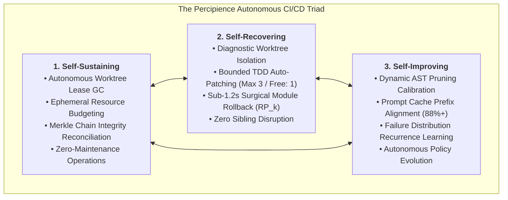
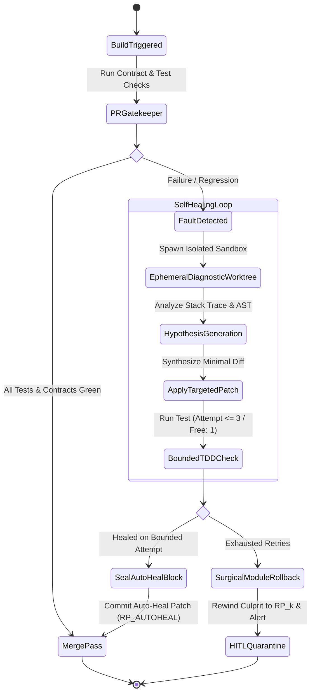
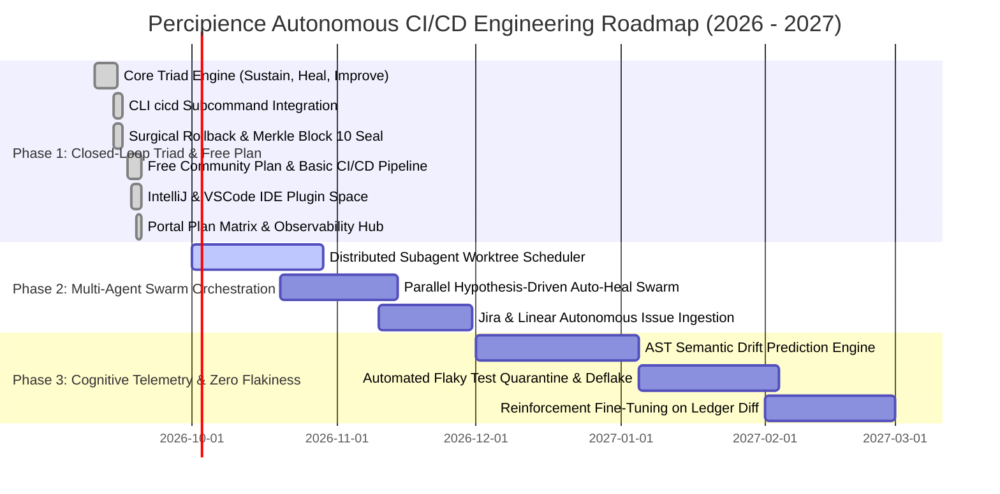

# Neutron Binary Percipience - Autonomous CI/CD Engineering Architecture & Roadmap
## Self-Sustaining, Self-Recovering & Self-Improving Autonomous Delivery Plane
> **Product Brand:** **Neutron Binary Percipience**  
> **Target Release:** Q4 2026 – Q3 2027  
> **Status:** Production Architecture & Engineering Roadmap  
> **Governing Spec:** [`.nb/plan/claude-context-engineering-parent-master-free_plan.md`](file:///Users/lakhwinder/PycharmProjects/nb_fairyfly/.nb/plan/claude-context-engineering-parent-master-free_plan.md)  
> **Live Observability Hub:** [`workplace/portal/server.py`](file:///Users/lakhwinder/PycharmProjects/nb_fairyfly/workplace/portal/server.py)  

---

## 1. Executive Vision: Beyond the Passive Gatekeeper

Traditional CI/CD pipelines (Jenkins, GitHub Actions, GitLab CI) and early AI gatekeepers operate as **passive validation gates**: they accept code, run test scripts, flag failures with a red cross, and block pull requests until a human engineer steps in to diagnose stack traces, refactor breaking diffs, and push subsequent commits.

In high-velocity enterprise organizations utilizing autonomous coding agents (Claude Code, Cursor Swarms, internal Devin-style swarms), this passive model creates an unsustainable bottleneck. When agents generate dozens of PRs hourly, human review queues collapse under merge conflicts, context poisoning, and runaway token bills.

**Neutron Binary Percipience** transforms the CI/CD gatekeeper into a **fully autonomous, closed-loop delivery plane** designed as a **Self-Sustaining, Self-Recovering, and Self-Improving system** across Free Community, Team, Business, and Enterprise tiers:

---

## 2. The Triad Architecture Specifications

### 2.1. Pillar 1: Self-Sustaining Engine (`SelfSustainingEngine`)
The self-sustaining subsystem eliminates operational toil and guarantees that the CI/CD environment remains healthy indefinitely without human DevOps intervention:
- **Autonomous Worktree Lease Reclamation**: Tracks all ephemeral subagent worktrees (`.workspaces/wt_*`). Reclaims expired leases immediately, releasing system file handles, ports, and memory.
- **Context Garbage Collection**: Cleans orphaned temporary diffs, test traces, and stale AST caches while preserving cryptographic Merkle audit records.
- **Continuous Merkle Ledger Reconciliation**: Automatically verifies SHA-256 state chain continuity (`context/ledger/context_ledger.yaml`) and syncs sanitized public projections (`context_ledger.public.yaml`).
- **Token FinOps Quota Auto-Throttling**: Monitors token burn rates against predefined enterprise velocity thresholds. If an agent swarm exhibits runaway recursion, it auto-downshifts reasoning tiers from Tier A (Opus/Sonnet) to Tier B (Haiku/Flash) before budget exhaustion.

---

### 2.2. Pillar 2: Self-Recovering Engine (`AutonomousHealer`)
The self-recovering subsystem intercepts test regressions, contract breaches, and context poisoning, applying automated surgical remediation:

#### Self-Healing Execution Rules:
1. **Isolated Fault Reproduction**: Faults are never diagnosed in place. Percipience spawns an ephemeral Git worktree (`WorktreeEngine.acquire()`) to isolate the failure context.
2. **Bounded TDD Loop**: The healing specialist (`agent_tester` / `agent_healer`) generates targeted hypothesis patches with a strict **maximum bound of 3 iterations** (1 in Free Community Plan). This mathematically guarantees that the self-healer never enters an infinite hallucination loop.
3. **Cryptographic Proof of Healing**: When a patch passes, it is staged, committed, and a new recovery block (`RP_AUTOHEAL_<MODULE>_<TIMESTAMP>`) is sealed into the Merkle chain.
4. **Deterministic Surgical Fallback**: If the patch fails after exhausting iterations, the engine initiates a **sub-1.2s poly-module surgical rollback** via `PoisoningSentinel.execute_surgical_rollback()`. Only the culprit module (e.g., `mod_billing`) is rewound to the last known green recovery point ($\text{RP}_k$), allowing all working sibling modules to proceed uninterrupted to production.

---

### 2.3. Pillar 3: Self-Improving Engine (`SelfImprovingEngine`)
The self-improving subsystem transforms passive test execution into a machine learning telemetry loop that dynamically optimizes context efficiency and pipeline speed:
- **Dynamic AST Pruning Calibration**:
  - Analyzes trailing gatekeeper runs. If average token reduction drops below $45\%$, the engine automatically shifts pruning rules to aggressive mode, saving additional token overhead.
  - If a test regression correlates with missing interface details, the engine selectively restores type alias and DTO contracts.
- **Prompt Cache Prefix Re-Alignment**:
  - Scans prompt suites in `agentic/prompts/` to ensure bit-for-bit invariant prefixes remain byte-identical across runs, preserving **90% prompt cache discount tiers**.
- **Recurrence Anomaly Mining**:
  - Mines recurring test failure signatures across PRs to generate proactive lint and invariant rules in `context/custom/rules/`.

---

## 3. Four-Phase Autonomous CI/CD Strategic Roadmap

