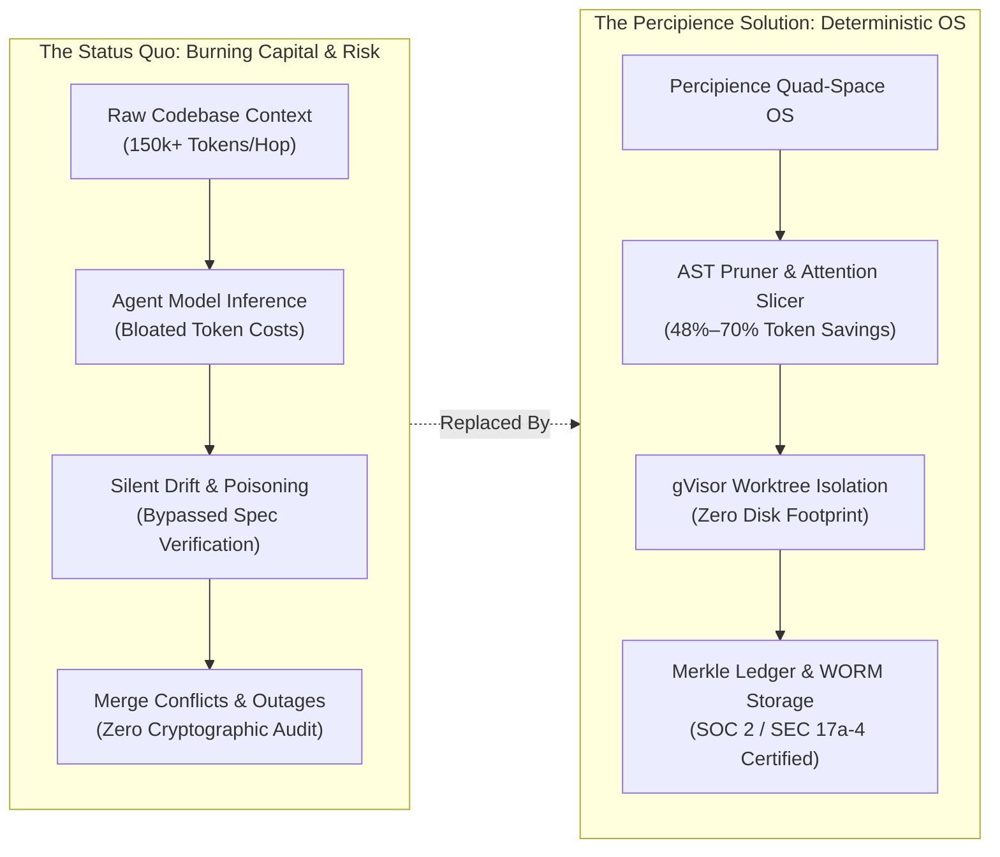
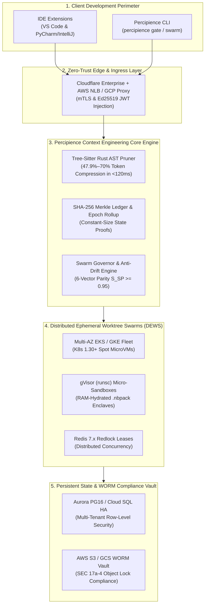
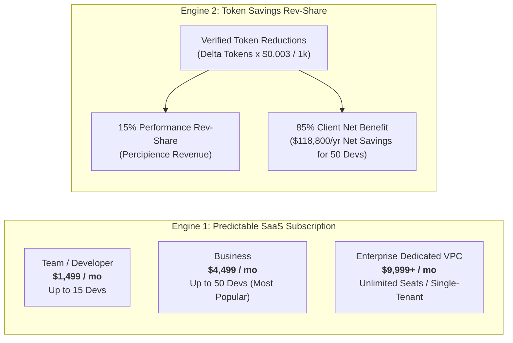
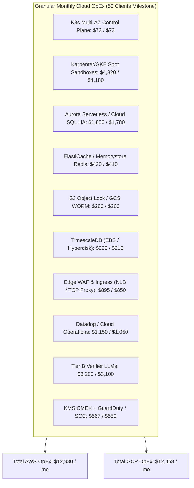
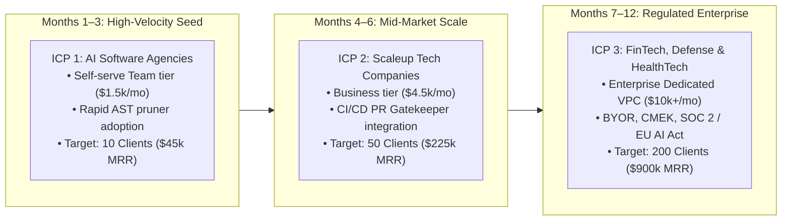
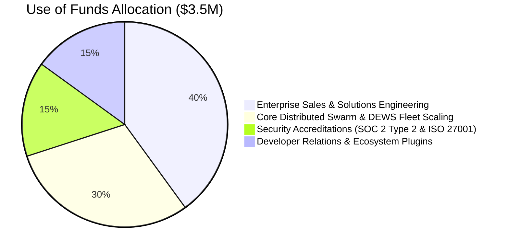

# Neutron Binary Percipience — Investor Presentation

> **Confidential Investor Deck | 5-Page Executive Briefing**  
> **Company**: Neutron Binary Inc.  
> **Product**: Percipience Context Engineering OS & Enterprise SaaS Platform  
> **Target Financing**: Seed / Series A Capital Raise  
> **Date**: October 2026  

---

## Page 1: The Context Crisis & The Percipience Opportunity

```
========================================================================================
                          PAGE 1 OF 5: EXECUTIVE THESIS & OPPORTUNITY
========================================================================================
```

### 1. The Macro Shift: Software Engineering is Becoming Autonomous
Enterprise development is undergoing the largest platform shift since cloud computing. Over **78% of Fortune 500 engineering teams** are actively deploying autonomous AI coding agents (Claude Code, Cursor, Aider, Devin, Gemini CLI). Software development is shifting from human syntax authoring to autonomous agent orchestration.

### 2. The Billion-Dollar Bottleneck: The "Context Explosion" Crisis
As autonomous agent swarms take on complex multi-file codebases, current LLM architectures break down across three catastrophic dimensions:
1. **Rampant Token Inefficiency**: 60%–70% of LLM token spend is squandered re-sending massive raw abstract syntax trees (ASTs), bloated helper functions, and repetitive interfaces on every agent reasoning hop.
2. **Context Poisoning & Hallucination Drift**: Unchecked recursive context pollution causes agents to mutate contracts, drift from product specifications, and loop destructively.
3. **Enterprise Compliance & Security Deadlocks**: Regulated enterprises (FinTech, Defense, HealthTech) cannot allow untracked code synthesis, lack of cryptographic lineage, or unencrypted intellectual property leaking to public model endpoints.



### 3. The Percipience Thesis
**Neutron Binary Percipience is the enterprise Context Engineering Operating System.** We decouple raw source code from LLM reasoning using structural AST token compression, cryptographic state ledgers, isolated ephemeral execution sandboxes, and mathematical anti-drift governance.

- **70% Token Reduction**: Sub-120ms Tree-Sitter pruning strips function bodies while strictly preserving interfaces and types.
- **100% Provenance & Non-Repudiation**: Every commit, prompt, and model decision is sealed in a SHA-256 Merkle DAG mirrored to immutable WORM storage.
- **Direct FinOps Alignment**: We save enterprise engineering orgs tens of thousands of dollars per month while taking a 15% performance revenue share on verified savings.

---

## Page 2: The Core Technological Moat (Quad-Space OS & DEWS)

```
========================================================================================
                         PAGE 2 OF 5: DEEP TECHNOLOGY & ARCHITECTURAL MOAT
========================================================================================
```

Percipience is built on a four-pillar, production-validated architectural foundation that solves agentic reliability at the compiler, runtime, and network layers:



### The 4 Proprietary Core Innovations

| Subsystem Innovation | Industry Baseline | The Percipience Advantage | Technical Moat & Protection |
| :--- | :--- | :--- | :--- |
| **1. Structural AST Token Optimization (`CAP-03`)** | Sending full raw files or naive regex truncation ($0.03–$0.06/hop). | Rust Tree-Sitter native daemon prunes code bodies to semantic skeletons (`...`) in $<120\text{ms}$. | Preserves 100% of types, signatures, and interfaces while saving **47.9% to 70% of tokens**. |
| **2. Cryptographic Merkle State Machine (`CAP-08`)** | Plain git commit messages with zero prompt or context provenance. | Continuous SHA-256 Merkle block sealing with rolling epoch rollups and automated WORM egress. | Non-repudiable audit ledger fulfilling **SOC 2 Type 2, SEC Rule 17a-4, and EU AI Act** requirements. |
| **3. Distributed Ephemeral Worktree Swarms (`DEWS`)** | Agents run locally on dirty working trees or unrestricted host shells. | Multi-container dynamic Karpenter/GKE spot fleets running inside **gVisor (`runsc`)** microVMs. | Volatile RAM `.nbpack` hydration leaves **0 bytes plaintext on host disks**; Redlock lease locking. |
| **4. 6-Vector Semantic Parity & Anti-Drift (`CAP-09`)** | Multi-agent swarms drift silently; rogue subagent explosion. | Mathematical 6-vector score ($S_{SP} = 0.20 S_{AST} + 0.25 S_{Contract} + \dots$). | Non-bypassable signed `HandoffToken` blocks merges if $S_{SP} < 0.95$; auto-revert or RFC evolve modes. |

---

## Page 3: Dual-Engine Business Model & FinOps Flywheel

```
========================================================================================
                          PAGE 3 OF 5: BUSINESS MODEL & MONETIZATION FLYWHEEL
========================================================================================
```

### 1. Dual Revenue Architecture
Percipience captures enterprise software value through two complementary monetization engines:



1. **High-Margin Tiered Subscriptions**:
   - **Team ($1,499/mo)**: Ideal for boutique AI consultancies; 5 concurrent worktree sandboxes, AST optimizer.
   - **Business ($4,499/mo)**: Mid-market engineering orgs; 20 concurrent sandboxes, PR gatekeeper, full Quad-Space.
   - **Enterprise ($9,999+/mo)**: Single-tenant dedicated AWS/GCP VPC, custom CMEK keys, air-gapped on-prem options.
2. **15% Token Savings Performance Revenue-Share**:
   - Every token pruned is cryptographically metered in `.nb/context/ledger/token_savings_ledger.yaml`.
   - Billed at 15% of gross token savings. For an average 50-developer team executing 35,000 PR checks/month:
     - Gross client savings: **$11,647 / month**
     - Percipience 15% Rev-Share: **$1,747 / month** (pure margin upside)
     - Net client annual savings: **$118,800 / year** (Percipience pays for itself)

### 2. The Negative CAC Flywheel
Because Percipience provides auditable token metering, our sales pitch is mathematically indisputable:
$$\text{Net Client Cost} = \text{SaaS Fee} - \text{Net Token Savings} \le \$0$$
Customers experience positive net ROI within the first 60 days of onboarding, driving viral word-of-mouth adoption across engineering leaders.

---

## Page 4: Infrastructure Economics, Unit Economics & Margin Scale

```
========================================================================================
                        PAGE 4 OF 5: INFRASTRUCTURE ECONOMICS & FINANCIAL MODEL
========================================================================================
```

### 1. Production Multi-Cloud Infrastructure (AWS & Google Cloud)
Percipience is engineered from day one for multi-cloud enterprise production. Complete Terraform blueprints for AWS (EKS/Aurora/ElastiCache/S3) and GCP (GKE/Cloud SQL/Memorystore/GCS) ensure zero cloud vendor lock-in.



### 2. Multi-Milestone Unit Economics & Gross Margin Scaling

| Scale Milestone | Active Customers | Active Dev Seats | Monthly Recurring Revenue (MRR) | Annual Run Rate (ARR) | Monthly Hosting OpEx (AWS / GCP) | OpEx as % of Revenue | Blended Gross Margin | Break-Even Customers |
| :--- | :---: | :---: | :---: | :---: | :---: | :---: | :---: | :---: |
| **Milestone 1: Seed** | **10** | ~300 | **$45,000 / mo** | **$540,000** | $3,850 / $3,690 | 8.5% / 8.2% | **86.8% / 87.2%** | **1.5 Customers** |
| **Milestone 2: Growth** | **50** | ~1,500 | **$225,000 / mo** | **$2,700,000** | $12,980 / $12,468 | 5.8% / 5.5% | **91.2% / 91.5%** | **1.5 Customers** |
| **Milestone 3: Scale** | **200** | ~6,000 | **$900,000 / mo** | **$10,800,000** | $39,450 / $37,830 | 4.4% / 4.2% | **94.1% / 94.3%** | **1.5 Customers** |

### Key Economic Takeaways:
- **Immediate Break-Even**: Just **1.5 business tier customers** fully cover the baseline multi-AZ infrastructure overhead. Customer #2 delivers positive operational EBITDA.
- **Extreme Capital Efficiency**: Infrastructure costs drop from **8.5% of revenue** at 10 customers down to **4.4% of revenue** at 200 customers.
- **World-Class Gross Margins**: High-operating leverage yields **91.2%–94.3% blended gross margins**, matching top-decile enterprise infrastructure software companies.

---

## Page 5: Go-to-Market Traction, Competitive Moat & The Ask

```
========================================================================================
                          PAGE 5 OF 5: GO-TO-MARKET, ROADMAP & THE INVESTMENT ASK
========================================================================================
```

### 1. Phased 3-Tier ICP Go-To-Market Strategy



### 2. Competitive Landscape & Defensibility Matrix

| Capability Dimension | Standard Frameworks (LangGraph, CrewAI) | Prompt Compressors (LLMLingua) | Generic Cloud CI (GitHub Actions) | Neutron Binary Percipience |
| :--- | :---: | :---: | :---: | :---: |
| **Structural AST Skeletonization** | ❌ No AST awareness | ❌ Token dropping (breaks syntax) | ❌ None | **✅ 100% syntax-safe AST pruner (<120ms)** |
| **Deterministic Code Sandboxing** | ❌ Local shell execution | ❌ In-memory only | ⚠️ Shared VMs | **✅ Ephemeral gVisor microVMs (DEWS)** |
| **Cryptographic Provenance Chain** | ❌ Ephemeral logs | ❌ None | ⚠️ Git commit history only | **✅ SHA-256 Merkle DAG + S3/GCS WORM** |
| **6-Vector Anti-Drift Parity** | ❌ Silent drift | ❌ None | ⚠️ Static unit tests | **✅ Non-bypassable signed HandoffTokens** |
| **FinOps Token Rev-Share** | ❌ Cost center | ❌ Manual benchmark | ❌ Flat compute charge | **✅ 15% Rev-share with cryptographic billing** |

### 3. The Investment Ask: $3,500,000 Seed / Series A Capital Raise
To capitalize on our product maturity and scale enterprise go-to-market:



- **40% ($1.4M) Enterprise Go-to-Market**: Direct enterprise sales and forward-deployed solutions engineers to close ICP 2 and ICP 3 multi-year contracts.
- **30% ($1.05M) Distributed Swarm Infrastructure**: Scaling the DEWS container fleet, multi-region failover, and hardware-accelerated AST parsing.
- **15% ($525k) Compliance & Regulatory Certifications**: Formal SOC 2 Type 2 attestation, ISO 27001 certification, and EU AI Act compliance packaging.
- **15% ($525k) Developer Ecosystem**: Expanding native IDE plugins (VS Code, JetBrains, Cursor, Windsurf) and developer advocacy.

### Summary Metrics:
- **Target ARR at 12 Months**: **$2,700,000 ARR** (50 Enterprise Customers)
- **Target ARR at 24 Months**: **$10,800,000 ARR** (200 Enterprise Customers)
- **Blended Gross Margin**: **> 91.2%**
- **Break-Even Pace**: **Profitable on Customer #2**

---
*Contact: leadership@neutronbinary.com | Confidential & Proprietary | © 2026 Neutron Binary Inc.*
