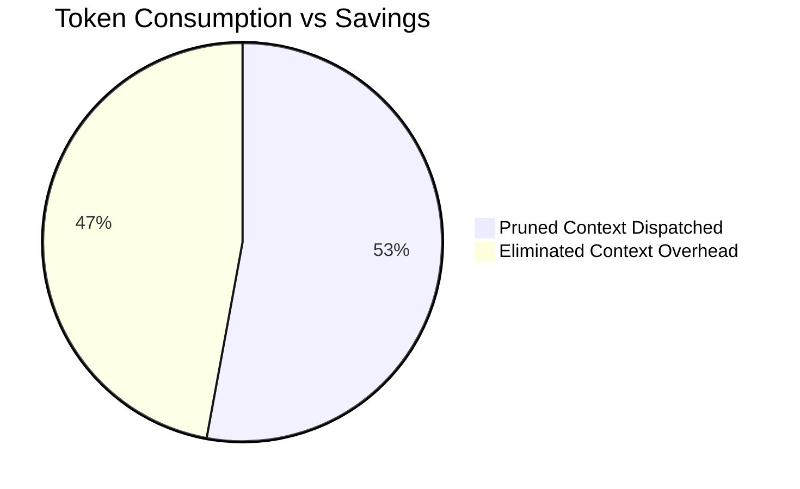

# Percipience Context Token Savings & Rev-Share Metering Report

> **Standard**: Continuous Context Optimization & AST Skeleton Pruning  
> **Pricing Model**: 15.0% Performance-Fee Revenue-Share on Realized Token Savings  
> **Last Updated**: 2026-09-24T17:59:56.030956+00:00  

---

## 1. Executive FinOps Summary

| Metric | Measured Value | Unit / Formula |
| :--- | :---: | :--- |
| **Total AST Pruning Events** | `1,872` | Recorded Code Transformations |
| **Uncompressed Context Tokens** | `8,336,028` | Raw AST Token Baseline |
| **Pruned Skeletons Dispatched** | `4,408,324` | AST Optimized Payload Tokens |
| **Net Context Tokens Saved** | **`3,927,704`** | Direct Token Waste Eliminated |
| **Average Context Reduction** | **`47.1%`** | Structural Context Compression |
| **Gross Model Spend Saved** | **`$11.7804`** | Baseline API Cost Avoidance |
| **Percipience 15% Performance Fee** | **`$1.7690`** | Value-Add Rev-Share Meter (15.0%) |
| **Net Customer ROI** | **`$10.0114`** | **Direct Cash Savings to Enterprise** |

---

## 2. Token Reduction Breakdown

---

## 3. Cryptographic State Machine Anchoring

- **Audited Ledger Path**: `.nb/context/ledger/token_savings_ledger.yaml`
- **Merkle Ledger Seal**: Synchronized with `context/ledger/context_ledger.yaml`
- **Verification Engine**: `workplace/core/token_tracker.py`
