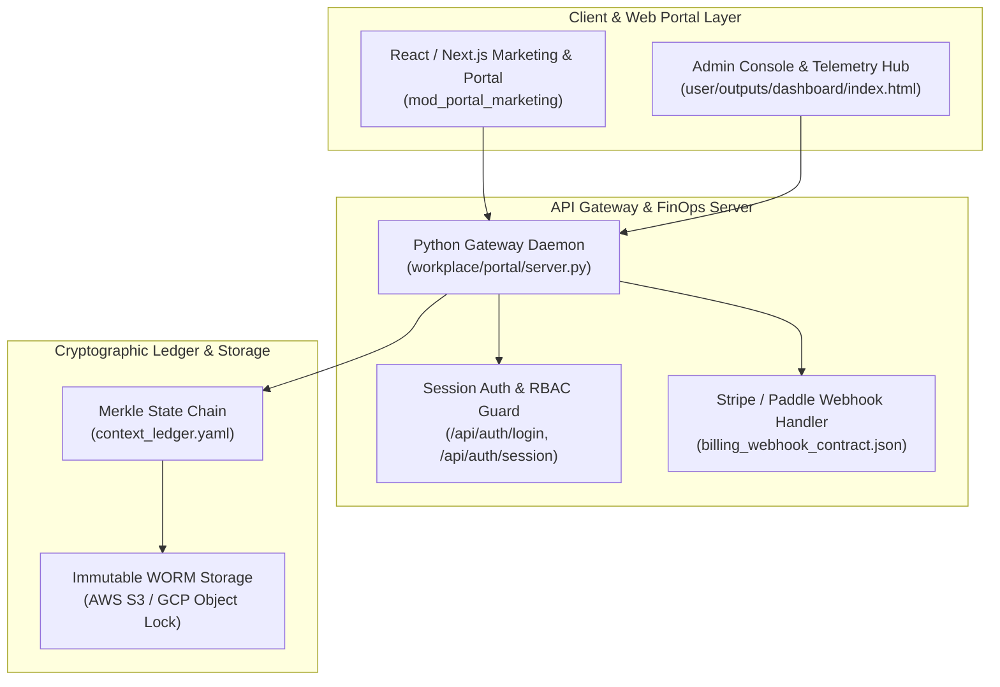

# Enterprise SaaS Portal Domain Architecture

> **Autonomously Maintained by**: `agent_enterprise_saas_portal_architect`  
> **Status**: ✅ Verified Valid Mermaid  
> **Canonical Target**: `workplace/modules/mod_portal_marketing/` & `workplace/portal/server.py`

## 1. System Topology & Component Layout

