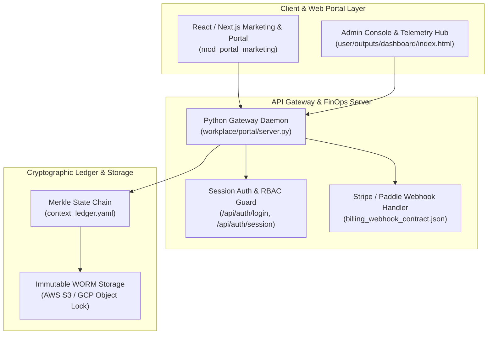
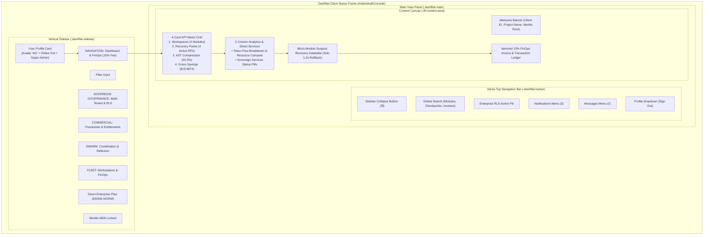

# Enterprise SaaS Portal Domain Architecture

> **Autonomously Maintained by**: `agent_enterprise_saas_portal_architect`  
> **Status**: ✅ Verified Valid Mermaid  
> **Canonical Target**: `workplace/modules/mod_portal_marketing/` & `workplace/portal/server.py`

## 1. System Topology & Component Layout

```mermaid
graph TD
  subgraph Frontend_Layer["Client & Web Portal Layer"]
    ReactApp["React / Next.js Marketing & Portal<br/>(mod_portal_marketing)"]
    AdminApp["Admin Console & Telemetry Hub<br/>(user/outputs/dashboard/index.html)"]
  end

  subgraph Gateway_Layer["API Gateway & FinOps Server"]
    Gateway["Python Gateway Daemon<br/>(workplace/portal/server.py)"]
    Auth["Session Auth & RBAC Guard<br/>(/api/auth/login, /api/auth/session)"]
    StripeWebhook["Stripe / Paddle Webhook Handler<br/>(billing_webhook_contract.json)"]
  end

  subgraph Enclave_Layer["Cryptographic Ledger & Storage"]
    MerkleLedger["Merkle State Chain<br/>(context_ledger.yaml)"]
    WORMEgress["Immutable WORM Storage<br/>(AWS S3 / GCP Object Lock)"]
  end

  ReactApp --> Gateway
  AdminApp --> Gateway
  Gateway --> Auth
  Gateway --> StripeWebhook
  Gateway --> MerkleLedger
  MerkleLedger --> WORMEgress
```

## 2. Dashflat Vertical-Default-Light Client Space Layout Architecture

The client space (`#client`) provides an enterprise console mirroring the **Dashflat Admin Vertical-Default-Light** template layout:

```mermaid
graph TD
  subgraph Client_Space_Container["Dashflat Client Space Frame (#clientAuthConsole)"]
    subgraph Sidebar["Vertical Sidebar (.dashflat-sidebar)"]
      Profile["User Profile Card<br/>(Avatar 'AG' + Online Dot + Super Admin)"]
      SearchNav["Filter Input"]
      NavGroup1["NAVIGATION: Dashboard & FinOps (15% Fee)"]
      NavGroup2["SOVEREIGN GOVERNANCE: Multi-Tenant & RLS"]
      NavGroup3["COMMERCIAL: Provisioner & Entitlements"]
      NavGroup4["SWARM: Coordination & Reflexion"]
      NavGroup5["FLEET: Workstations & FinOps"]
      DirectCard["Direct Enterprise Plan (650GB WORM)"]
      ChainFooter["Merkle #828 Locked"]
    end

    subgraph Main_Panel["Main View Panel (.dashflat-main)"]
      subgraph Topbar["Sticky Top Navigation Bar (.dashflat-topbar)"]
        Toggle["Sidebar Collapse Button (☰)"]
        SearchBox["Global Search (Modules, Checkpoints, Invoices)"]
        StatusPill["Enterprise RLS Active Pill"]
        Notifs["Notifications Menu (3)"]
        Msgs["Messages Menu (2)"]
        UserMenu["Profile Dropdown (Sign Out)"]
      end

      subgraph Canvas["Content Canvas (.df-content-area)"]
        HeaderBanner["Welcome Banner (Client ID, Project Name, Merkle Root)"]
        KPIGrid["4-Card KPI Metric Grid<br/>1. Workspaces (4 Modules)<br/>2. Recovery Points (4 Active RPs)<br/>3. AST Compression (50.3%)<br/>4. Gross Savings ($15.6974)"]
        AnalyticsGrid["2-Column Analytics & Direct Services<br/>• Token Flow Breakdown & Resource Compute<br/>• Sovereign Services Status Pills"]
        ModuleTable["Micro-Module Surgical Recovery Datatable (Sub-1.2s Rollback)"]
        InvoiceTable["Itemized 15% FinOps Invoice & Transaction Ledger"]
      end
    end
  end

  Profile --> NavGroup1
  NavGroup1 --> KPIGrid
  KPIGrid --> AnalyticsGrid
  AnalyticsGrid --> ModuleTable
  ModuleTable --> InvoiceTable
```

### 2.1 Component Specifications
- **Collapsible Sidebar**: Compact 72px icon mode or full 260px expanded mode with smooth CSS transitions.
- **Top Navigation Bar**: Persistent sticky header containing global search, multi-tenant RLS badges, notification dropdowns, and dual-theme switcher.
- **4-Card KPI Metrics**: Flat BootstrapDash card styling featuring high-contrast metrics, percentage trend badges, and colored gradient progress accents.
- **Micro-Module Recovery Datatable**: Tabular display of individual project micro-modules with SHA-256 Merkle blocks and sub-1.2s single-click surgical rollback action buttons.
- **Itemized FinOps Ledger**: Transparent mathematical derivation of verified token savings and 15% performance fee accounting.
