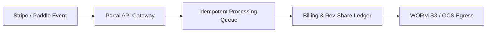

# Enterprise SaaS Portal Data Flow & Ingestion Streams

```mermaid
flowchart LR
  Webhook["Stripe / Paddle Event"]
  Gateway["Portal API Gateway"]
  Queue["Idempotent Processing Queue"]
  Billing["Billing & Rev-Share Ledger"]
  WORM["WORM S3 / GCS Egress"]

  Webhook --> Gateway --> Queue --> Billing --> WORM
```
