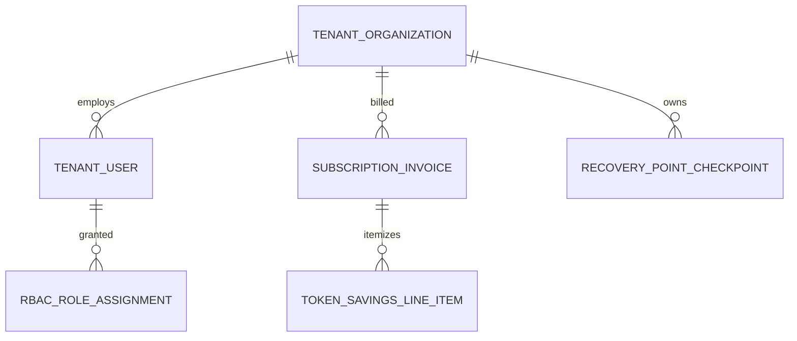

# Enterprise SaaS Portal Entity-Relationship Models

```mermaid
erDiagram
  TENANT_ORGANIZATION ||--o{ TENANT_USER : employs
  TENANT_ORGANIZATION ||--o{ SUBSCRIPTION_INVOICE : billed
  SUBSCRIPTION_INVOICE ||--o{ TOKEN_SAVINGS_LINE_ITEM : itemizes
  TENANT_ORGANIZATION ||--o{ RECOVERY_POINT_CHECKPOINT : owns
  TENANT_USER ||--o{ RBAC_ROLE_ASSIGNMENT : granted
```
