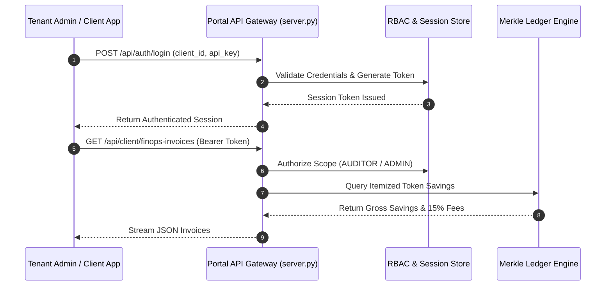

# Enterprise SaaS Portal Runtime Execution & Sequence Flows

```mermaid
sequenceDiagram
  autonumber
  participant Tenant as Tenant Admin / Client App
  participant Gateway as Portal API Gateway (server.py)
  participant Auth as RBAC & Session Store
  participant Ledger as Merkle Ledger Engine

  Tenant->>Gateway: POST /api/auth/login (client_id, api_key)
  Gateway->>Auth: Validate Credentials & Generate Token
  Auth-->>Gateway: Session Token Issued
  Gateway-->>Tenant: Return Authenticated Session
  Tenant->>Gateway: GET /api/client/finops-invoices (Bearer Token)
  Gateway->>Auth: Authorize Scope (AUDITOR / ADMIN)
  Gateway->>Ledger: Query Itemized Token Savings
  Ledger-->>Gateway: Return Gross Savings & 15% Fees
  Gateway-->>Tenant: Stream JSON Invoices
```
