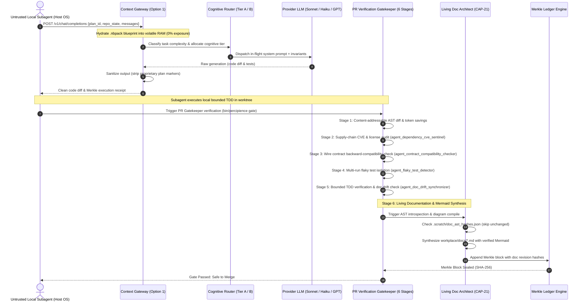

# Runtime Execution & Cross-Module Sequence Flows

> **Autonomously Synchronized**: 2026-09-17T02:01:16.569103+00:00  
> **Engine**: `agent_living_doc_architect` (CAP-21)  
> **Diagram Validation**: ✅ Valid Mermaid

## End-to-End Context Gateway & CI/CD Verification Flow

### Flow Mechanics
1. **Option 1 Gateway**: In-flight prompt injection ensures local developer agent never touches KMS keys or encrypted .nbpack plan contents.
2. **Deterministic TDD**: Worktree develops in isolation, executing bounded retry loops.
3. **Multi-Stage Verification**: All 6 PR verification stages run deterministically.
4. **Living Documentation**: AST changes automatically trigger doc updates before Merkle sealing.
