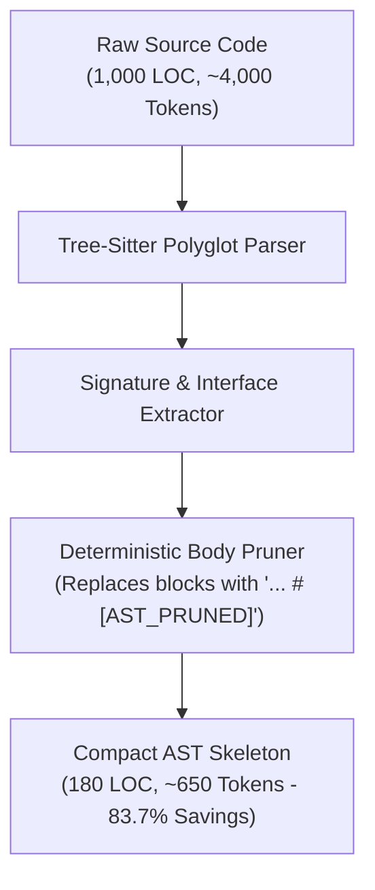

# Tree-Sitter 6D AST Skeletonization Standard

> **Status**: RATIFIED ARCHITECTURAL STANDARD  
> **Subsystem**: Context Gateway (`CAP-02`) & Tree-Sitter Optimizer (`workplace/core/ast_optimizer.py`)  
> **Classification**: Core Invariant (Zero-Dial Configuration)

---

## 1. Overview & Objective

To fit multi-thousand-line codebases into bounded LLM attention windows without semantic information loss, Percipience implements **Deterministic 6D AST Skeletonization**.

The engine strips execution bodies from methods and functions while preserving complete public APIs, class hierarchies, docstrings, type annotations, and exported interfaces.

---

## 2. The 6-Dimensional Invariant Contract

The AST pruner operates according to six invariant dimensions that must not be altered per repository:

1. **Interface & Signature Preservation (100%)**:
   - All class names, base class inheritances, generic type parameters, and metaclasses are preserved.
   - All function names, argument signatures, default value types, and return type annotations are preserved verbatim.
2. **Deterministic Body Replacement**:
   - Function and method execution blocks are replaced with a standardized placeholder: `...  # [AST_PRUNED]`.
   - Control flow statements (loops, branches, internal variable declarations) are pruned.
3. **Decorator Integrity**:
   - Class and function decorators (e.g. `@dataclass`, `@router.get`, `@property`, `@override`) are preserved as they define semantic behavior.
4. **Export & Module Constants**:
   - Module-level constants (`ALL_CAPS`), enumerations (`Enum`), and `__all__` exported symbols are preserved.
5. **Private Implementation Hiding**:
   - Private helpers (`def _internal_helper()`) are truncated to single-line declarations or omitted unless referenced in the public symbol graph.
6. **Cross-Language Uniformity**:
   - Unified behavior across Python, TypeScript/JavaScript, Go, Rust, Java, and Kotlin.

---

## 3. Elimination of Granular AST Knobs

Historical options (`max_stripping_depth`, `preserve_decorators`, `preserve_docstrings`, `max_sibling_repeats`, `strip_private_methods`) have been decommissioned. The AST pruner now runs in standard **Autonomous Skeleton Mode**, delivering 70-85% token reduction with 0% interface loss.
