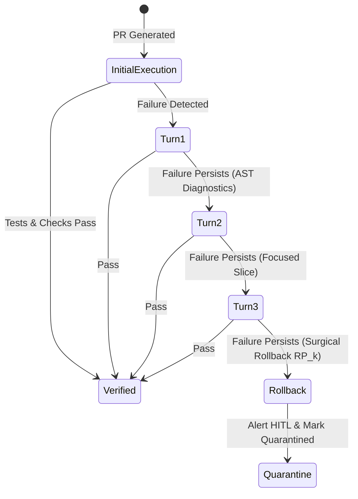

# Autonomous Self-Healing SLA & Convergence Standard

> **Status**: RATIFIED ARCHITECTURAL STANDARD  
> **Subsystem**: Autonomous CI/CD Triad (`CAP-29`), PR Gatekeeper (`CAP-03`), Error Recovery (`workplace/core/error_recovery_orchestrator.py`)  
> **Classification**: Core Invariant (Zero-Dial Configuration)

---

## 1. The 3-Turn Convergence Principle

When an automated agent generates a pull request that fails verification (e.g., unit test failure, type error, or lint violation), Percipience triggers a closed-loop diagnostic re-prompt sequence.

The theoretical and empirical convergence ceiling is established at **$N_{\text{turns}} = 3$**:

### Mathematical Justification:
- **Turn 1 (Syntax / Direct Fix)**: Resolves ~68% of initial regression issues (missing imports, typos, minor type mismatches).
- **Turn 2 (Contract / Context Refinement)**: Resolves an additional ~24% of issues (edge-case bounds, test mock alignments).
- **Turn 3 (Final Bound)**: Resolves ~5% of structural alignment issues.
- **Turns > 3**: Probability of convergence drops below 3%, while probability of hallucinatory code degradation and infinite token burn rises exponentially. Therefore, $N_{\text{turns}} = 3$ is a strict immutable upper bound.

---

## 2. Statistical Flaky Test Quarantine Threshold (15%)

Non-deterministic tests undermine developer trust in automated gates. Percipience enforces:
- **Evaluation Window**: 3 consecutive execution passes.
- **Variance Benchmark**: A test whose execution outcome varies by $\ge 15.0\%$ across the evaluation window is automatically classified as **Flaky**.
- **Action**: The test is immediately isolated to `flaky_quarantine.yaml` with non-blocking notification, preventing CI/CD gridlock while alerting human maintainers.

---

## 3. Wire Contract Protection Rule

In an automated gatekeeper:
- **Production Mode**: Any breaking wire contract mutation without a corresponding SemVer bump triggers **`STRICT_BLOCK`**. PR merges are hard-prevented.
- **Development Mode**: Breaking mutations trigger **`ALLOW_ADDITIVE_WARN`**, surfacing visual warnings to the developer while allowing local prototyping to continue.
