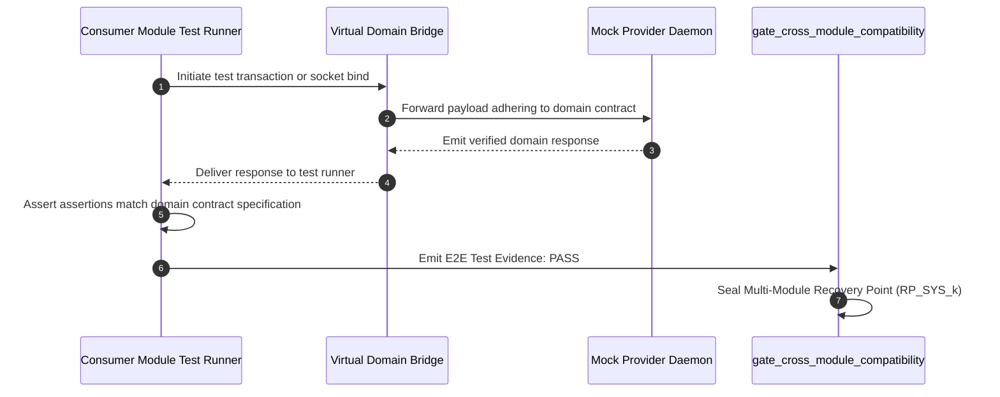

# Layerable Context Engineering Plan: {{DOMAIN_NAME}} Space

### Executive Overview & Domain Grounding
This document is a standardized **Layerable Domain-Specific Context Engineering Plan** designed to overlay onto the generic **Parent Master Context Engineering Framework** (`.nb/plan/claude-context-engineering-parent-master-plan.md`). While the parent framework governs universal poly-module lifecycle orchestration, cryptographic Merkle state verification, AST token compression, and autonomous CI/CD, this domain layer injects domain-specific wire contracts, specialized subagents, and verification bridges required for:

1. **{{DOMAIN_CORE_CAPABILITY_1}}**: Description of core technology stack, target protocols, or runtimes.
2. **{{DOMAIN_CORE_CAPABILITY_2}}**: Description of domain data structures, state machines, or transactional boundaries.
3. **{{DOMAIN_CORE_CAPABILITY_3}}**: Description of security, compliance, or strict domain-level invariant constraints.
4. **{{DOMAIN_CORE_CAPABILITY_4}}**: Automated testing harnesses, virtual mock loopbacks, or hardware/runtime simulators.

---

## 1. Domain-Specific Quad-Space Mapping

When layered onto the Parent Master Plan, the workspace instantiates domain-specialized structures across the four clean directories:

```
.
├── context/
│   ├── contracts/
│   │   ├── {{DOMAIN_WIRE_CONTRACT_1}}.yaml     # Primary inter-module communication wire contract
│   │   └── {{DOMAIN_WIRE_CONTRACT_2}}.json     # Domain event payloads or state schema validations
│   └── rules/
│       └── {{DOMAIN_INVARIANTS_RULE}}.md       # Domain non-negotiable architectural invariant rules
├── agentic/
│   ├── custom/agents/
│   │   ├── {{SPECIALIST_AGENT_1}}.yaml         # Subagent 1: Domain-specific producer/driver specialist
│   │   └── {{SPECIALIST_AGENT_2}}.yaml         # Subagent 2: Domain-specific consumer/client specialist
│   └── custom/workflows/
│       └── {{DOMAIN_DELIVERY_WORKFLOW}}.yaml   # Domain-specific verification and build pipeline DAG
├── workplace/
│   ├── modules/
│   │   ├── mod_{{PROVIDER_MODULE}}/            # Core provider subsystem implementation
│   │   └── mod_{{CONSUMER_MODULE}}/            # Consumer application or client implementation
│   ├── shared/
│   │   └── contracts/                          # Code-generated types, stubs, and protocol buffers
│   └── templates/bridge/
│       └── virtual_{{DOMAIN_SIMULATOR}}_bridge.py # Virtual daemon/mock socket bridging modules
└── user/
    ├── inputs/
    │   └── {{DOMAIN_MVS_SPEC}}.yaml            # Sparse initial user specification / requirements
    └── hitl/
        └── poisoning_quarantine.md             # Quarantine ledger for domain-specific contract violations
```

---

## 2. Wire Contracts & Safety Invariants (`context/contracts/`, `context/rules/`)

The domain layer establishes non-overridable wire contracts verified by the pre-commit gatekeeper:

### 2.1. `context/contracts/{{DOMAIN_WIRE_CONTRACT_1}}.yaml`
```yaml
schema_version: "1.0.0"
domain: "{{DOMAIN_SLUG}}"
contract_type: "RPC_OR_REST_OR_STREAM"
service_endpoint: "/api/v1/{{DOMAIN_SLUG}}"
payload_schema:
  type: "object"
  required: ["id", "timestamp", "payload"]
  properties:
    id: { type: "string", format: "uuid" }
    timestamp: { type: "string", format: "date-time" }
    payload: { type: "object" }
```

### 2.2. `context/rules/{{DOMAIN_INVARIANTS_RULE}}.md`
- **Domain Invariant 1**: Strict contract conformity across producer and consumer modules.
- **Domain Invariant 2**: Memory budget, latency, or throughput bounds.
- **Domain Invariant 3**: Zero-drift compliance with parent cryptographic Merkle verification.

---

## 3. Specialized Domain Subagents & Workflows (`agentic/custom/`)

### 3.1. `agentic/custom/agents/{{SPECIALIST_AGENT_1}}.yaml`
```yaml
agent_id: "agent_{{SPECIALIST_AGENT_1}}"
name: "{{DOMAIN_NAME}} Specialist"
version: "1.0.0"
category: "domain_engineering"
model_tiering:
  active_tier: "Tier_A"
  tier_a_model: "claude-3-7-sonnet / pro"
  tier_b_model: "claude-3-5-haiku / flash"
system_prompt_ref: "agentic/prompts/{{SPECIALIST_AGENT_1}}_prompt.md"
budget_limits:
  max_tokens_per_turn: 25000
  max_ast_pruned_tokens: 12000
permissions:
  allow_worktree_isolation: true
  allowed_module_paths:
    - "workplace/modules/mod_{{PROVIDER_MODULE}}"
    - "context/contracts"
enforced_invariants:
  - "Zero AST contract drift"
  - "Mandatory unit and simulation test coverage >= 85%"
```

---

## 4. Virtual Emulation & End-to-End Simulation Loopback Bridge

In autonomous CI/CD pipelines, external environments or hardware may be unavailable. The domain test harness creates a virtual integration bridge:



---

## 5. Domain-Specific Surgical Rollback & Poisoning Defense

Under this domain plan, recovery points are strictly isolated per module:
- `RP_{{PROVIDER_PREFIX}}_001`: Verified clean state of provider module.
- `RP_{{CONSUMER_PREFIX}}_002`: Verified clean state of consumer module.

**Failure Mitigation**:
If an agent hallucinates an incompatible field or introduces a dependency breach in `mod_{{CONSUMER_MODULE}}`, the gatekeeper executes a surgical rollback:
1. `PoisoningSentinel.execute_surgical_rollback` restores only `workplace/modules/mod_{{CONSUMER_MODULE}}/` to its last verified recovery point.
2. Sibling module `workplace/modules/mod_{{PROVIDER_MODULE}}/` remains untouched.
3. The invalid state is logged to `user/hitl/poisoning_quarantine.md`, and a new Merkle block is sealed.

---

## 6. Encrypted Packaging & Layer Consumption Workflow (`.nbpack`)

To protect proprietary domain intellectual property, contracts, and prompt trees, this layer can be compiled into a tamper-proof `.nbpack` binary envelope:

### 6.1. Compiling the Sealed Domain Bundle
```bash
./workplace/workplace/bin/percipience layer pack \
  --plan .nb/plan/templates/custom_{{DOMAIN_SLUG}}_domain_plan.md \
  --output .nb/bundles/{{DOMAIN_SLUG}}_domain.nbpack \
  --include-spaces context/contracts,context/rules,agentic/custom
```

### 6.2. Consuming the Encrypted Bundle in Target Repository
```bash
# Hydrate and layer directly into secure RAM enclave without writing plaintext to disk
./workplace/workplace/bin/percipience layer apply \
  --pack .nb/bundles/{{DOMAIN_SLUG}}_domain.nbpack \
  --in-memory-only \
  --mode multi_module
```

When consumed:
1. The **Percipience Enclave Runtime** validates the `NBPACK_V2_SEALED` binary header and SHA-256 signature.
2. Domain contracts and subagent prompts are mounted into volatile RAM memory.
3. The master context ledger records the layer application with a newly sealed cryptographic Merkle block.

---

## 7. CLI Layering Commands & Verification Protocol

To apply this custom domain layer onto a fresh or existing repository:

```bash
# 1. Initialize repository using Parent Master Plan
./workplace/workplace/bin/percipience init --mode multi_module --parent-plan .nb/plan/claude-context-engineering-parent-master-plan.md

# 2. Apply this domain layer
./workplace/workplace/bin/percipience layer apply --plan .nb/plan/templates/custom_{{DOMAIN_SLUG}}_domain_plan.md

# 3. Scaffold and integrate domain subagents
./workplace/workplace/bin/percipience agent create --name {{SPECIALIST_AGENT_1}} --template cicd_quality --role "{{DOMAIN_NAME}} Specialist"
./workplace/workplace/bin/percipience agent integrate --agent agent_{{SPECIALIST_AGENT_1}} --workflow wf_pr_gatekeeper --after step_contract_compat

# 4. Run PR Gatekeeper verification
./workplace/workplace/bin/percipience gate
```
