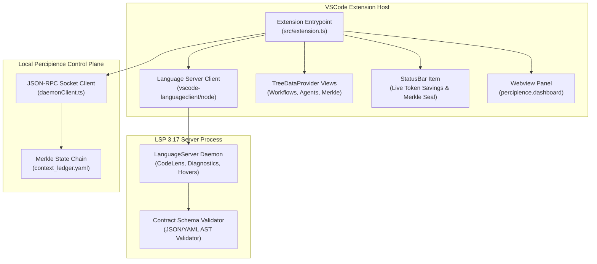

# Visual Studio Code Extension Space Architecture

> **Autonomously Maintained by**: `agent_vscode_extension_architect`  
> **Status**: ✅ Verified Valid Mermaid  
> **Canonical Target**: `workplace/modules/mod_vscode_extension/`

## 1. System Topology & Component Layout

