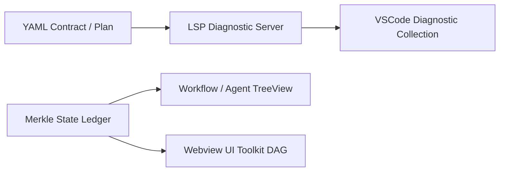

# Visual Studio Code Extension Data Flow & Event Streams

```mermaid
flowchart LR
  YAMLDoc["YAML Contract / Plan"]
  LSP["LSP Diagnostic Server"]
  Diagnostics["VSCode Diagnostic Collection"]
  TreeProvider["Workflow / Agent TreeView"]
  Webview["Webview UI Toolkit DAG"]
  Ledger["Merkle State Ledger"]

  YAMLDoc --> LSP --> Diagnostics
  Ledger --> TreeProvider
  Ledger --> Webview
```
