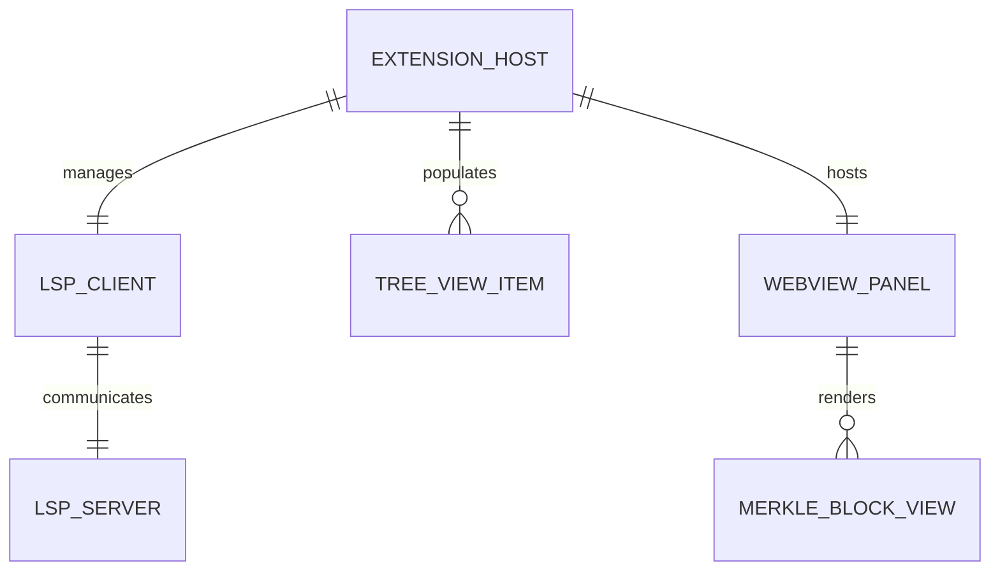

# Visual Studio Code Extension Entity-Relationship Models

```mermaid
erDiagram
  EXTENSION_HOST ||--|| LSP_CLIENT : manages
  LSP_CLIENT ||--|| LSP_SERVER : communicates
  EXTENSION_HOST ||--o{ TREE_VIEW_ITEM : populates
  EXTENSION_HOST ||--|| WEBVIEW_PANEL : hosts
  WEBVIEW_PANEL ||--o{ MERKLE_BLOCK_VIEW : renders
```
