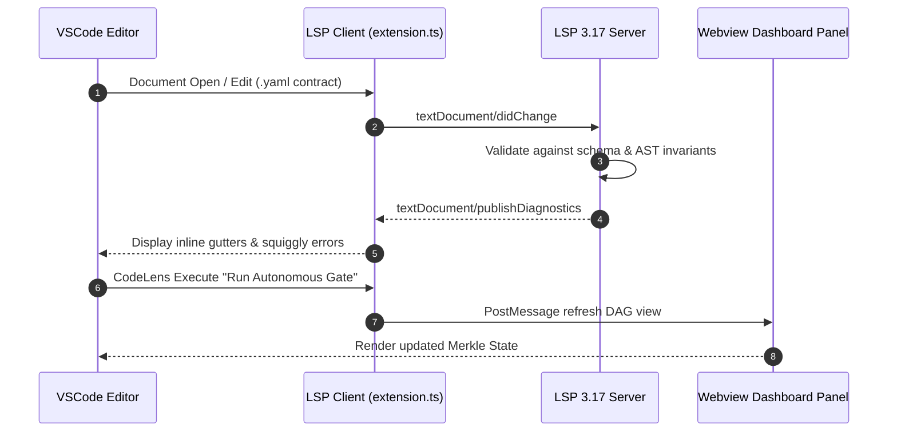

# Visual Studio Code Extension Runtime Execution & Sequence Flows

```mermaid
sequenceDiagram
  autonumber
  participant Editor as VSCode Editor
  participant LSPClient as LSP Client (extension.ts)
  participant LSPServer as LSP 3.17 Server
  participant Webview as Webview Dashboard Panel

  Editor->>LSPClient: Document Open / Edit (.yaml contract)
  LSPClient->>LSPServer: textDocument/didChange
  LSPServer->>LSPServer: Validate against schema & AST invariants
  LSPServer-->>LSPClient: textDocument/publishDiagnostics
  LSPClient-->>Editor: Display inline gutters & squiggly errors
  Editor->>LSPClient: CodeLens Execute "Run Autonomous Gate"
  LSPClient->>Webview: PostMessage refresh DAG view
  Webview-->>Editor: Render updated Merkle State
```
