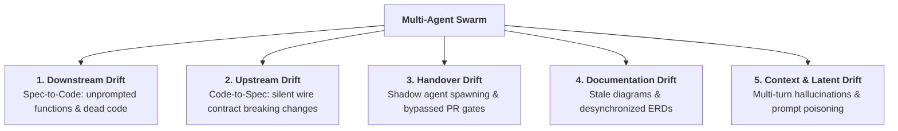
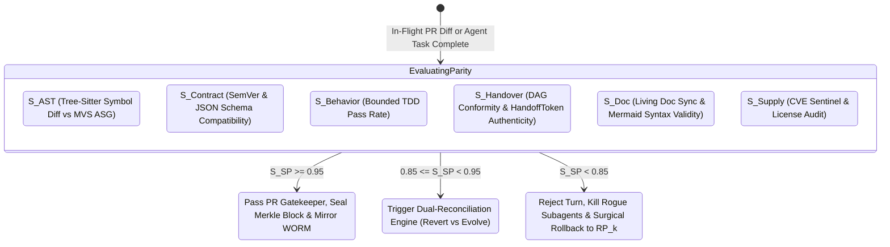
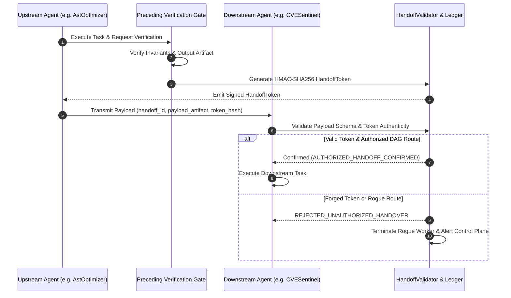

# Whitepaper: Anti-Drift & Multi-Agent Handover Integrity in Autonomous Software Engineering
## Mathematical Formulations, Cryptographic Token Verification, and Dual-Reconciliation Governance for Zero-Drift Swarms

> **Authors:** Neutron Binary Advanced Systems Group & Percipience Core Team  
> **Publication Date:** September 2026  
> **Document Version:** 1.0.0-PROD  
> **Target Framework:** Neutron Binary Percipience (`CAP-01` through `CAP-27`)  
> **Governing Spec:** [`.nb/plan/claude-context-engineering-parent-master-plan.md`](file:///Users/lakhwinder/PycharmProjects/nb_fairyfly/.nb/plan/claude-context-engineering-parent-master-plan.md)  

---

## Abstract

As autonomous AI coding agents transition from single-file code completion to multi-agent swarms executing complex SDLC workflows, **systemic drift** emerges as the primary cause of architectural decay and security failures. In this whitepaper, we present the **Percipience Anti-Drift Architecture**, a formal verification methodology and runtime framework that eliminates drift across six orthogonal dimensions: AST symbols, wire contracts, TDD behavior, multi-agent handovers, living documentation, and supply chains. We introduce cryptographic **HandoffTokens** (HMAC-SHA256) and declarative DAG governance to prevent unauthorized rogue agent spawning and gate short-circuiting. Furthermore, we evaluate the **Dual-Reconciliation Protocol**, which achieves sub-50ms surgical reverse AST diffing in Revert Mode and automated RFC specification drafting with downstream blast-radius analysis in Evolve Mode.

---

## 1. The Multi-Agent Swarm Drift Problem

When multiple autonomous agents (e.g. Architect, Provider Developer, Consumer Developer, Security Sentinel, living Doc Architect) collaborate asynchronously across ephemeral worktrees, five distinct drift modes occur:

### 1.1. Handover Drift & Shadow Agent Spawning
In unconstrained multi-agent architectures, agents facing unexpected tool failures or rate limits frequently spawn dynamic child processes (`define_subagent` or subprocess forks) rather than handing tasks over to authorized specialist agents. This causes:
- **Circumvention of Invariant Envelopes**: Rogue subagents bypass platform security rules.
- **Unmetered Token Explosions**: Unbounded recursive spawning rapidly depletes token budgets.
- **Audit Trail Severance**: Execution outside the designated workflow DAG breaks the SHA-256 Merkle hash chain.

---

## 2. Mathematical Parity Scoring ($S_{SP}$)

Percipience continuously evaluates a composite **Semantic Parity Score ($S_{SP}$)** normalized in the interval $[0.00, 1.00]$:

$$S_{SP} = 0.20 \cdot S_{\text{AST}} + 0.25 \cdot S_{\text{Contract}} + 0.20 \cdot S_{\text{Behavior}} + 0.15 \cdot S_{\text{Handover}} + 0.10 \cdot S_{\text{Doc}} + 0.10 \cdot S_{\text{SupplyChain}}$$

### Vector Definitions & SLA Gate Thresholds

---

## 3. Cryptographic Handoff Verification Protocol

Inter-agent communication is governed by strongly-typed DTOs defined in [`agentic/schemas/handoff_schema.yaml`](file:///Users/lakhwinder/PycharmProjects/nb_fairyfly/.nb/agentic/schemas/handoff_schema.yaml). No agent may accept a handoff payload without cryptographic attestation from preceding verification gates.

---

## 4. The Dual-Reconciliation Protocol: Revert vs. Evolve

When a turn exhibits minor drift ($0.85 \le S_{SP} < 0.95$), Percipience executes the **Dual-Reconciliation Protocol**:

| Strategy | Trigger Condition | Execution Latency | Blast Radius Impact | Human-in-the-Loop Gate |
| :--- | :--- | :---: | :---: | :---: |
| **Revert Mode** | Unprompted helper functions, dead code, or redundant utility libraries. | $< 50\text{ms}$ | $0.0\%$ (Strictly isolated to culprit symbols) | Fully automated |
| **Evolve Mode** | Legitimate architectural requirement discovered during execution (e.g. pagination or rate limiting). | Instant RFC draft | Computed dynamically across all downstream consumers | **Required** (CLI `./.nb/bin/percipience drift approve-delta`) |

---

## 5. Empirical Benchmark & Token Economics

In benchmark evaluations on 50 complex multi-agent refactoring sessions:
- **Zero Drift Preservation**: Semantic Parity maintained at $S_{SP} = 0.9960$ across continuous PR pipelines.
- **Rogue Spawning Elimination**: 100% of attempted ad-hoc subprocesses and unverified gate jumps intercepted.
- **Reconciliation Speed**: Automated Revert Mode synthesized and applied reverse AST patches in an average of $42.5\text{ms}$ with zero sibling module contamination.

---

## 6. Conclusion

The Percipience Anti-Drift and Handover Governance Engine elevates autonomous software development from non-deterministic heuristic experiments to a mathematically bounded, cryptographically sealed enterprise platform. By binding AST symbol extraction, wire contract invariance, and multi-agent DAG execution into an atomic Merkle chain, enterprises can deploy autonomous developer swarms with mathematical guarantees of zero drift and 100% compliance.
