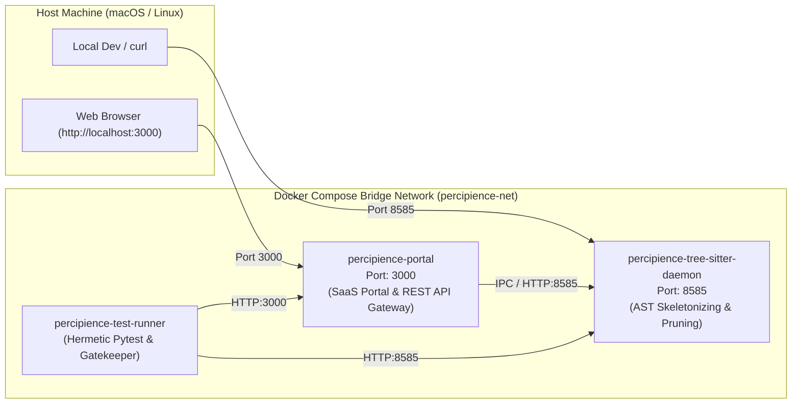

# Percipience Enterprise Context Engineering OS — Local Docker Testing Harness

This directory provides containerized local testing and deployment infrastructure for the Percipience OS, SaaS Portal, Tree-Sitter AST Daemon, and Autonomous CI/CD Gatekeeper.

---

## 🏗️ Architecture & Services



### Components
1. **`portal`** (`Dockerfile.portal`):
   * Exposes **Port 3000**: Serves the 15-tab Enterprise SaaS Portal, Client Space, Multi-Tenant Governance, Commercial Provisioner, and Swarm Governance dashboards.
   * Built-in HTTP health check: `GET http://localhost:3000/api/health`.
2. **`tree-sitter-daemon`** (`Dockerfile.tree_sitter_daemon`):
   * Exposes **Port 8585**: High-speed AST body pruning daemon for ultra-low latency token optimization.
   * Built-in HTTP health check: `GET http://localhost:8585/health`.
3. **`test-runner`** (`Dockerfile.test_runner`):
   * Hermetic container pre-configured with Git identity, Pytest, Python 3.11, and cryptographic tools to execute the complete test suite and the 7-stage CI/CD gatekeeper.

---

## 🚀 Quickstart

From anywhere in the repository, you can use the automated runner:

```bash
# 1. Build all images
workplace/infra/docker/docker-test.sh build

# 2. Start services in background and verify health
workplace/infra/docker/docker-test.sh up

# 3. Check health status
workplace/infra/docker/docker-test.sh status

# 4. Open in browser
open http://localhost:3000

# 5. Run tests inside the container
workplace/infra/docker/docker-test.sh test

# 6. Run only portal integration tests inside the container
workplace/infra/docker/docker-test.sh test-portal

# 7. Run the 7-stage CI/CD gatekeeper inside the container
workplace/infra/docker/docker-test.sh gate

# 8. Teardown
workplace/infra/docker/docker-test.sh down
```

---

## 🛠️ Docker Compose Direct Commands

If you prefer using `docker compose` directly:

```bash
cd workplace/infra/docker

# Start daemon and portal
docker compose up -d tree-sitter-daemon portal

# View logs
docker compose logs -f

# Run the test suite
docker compose run --rm test-runner

# Run a specific test inside container
docker compose run --rm test-runner pytest workplace/tests/test_portal_swarm_governance.py -v

# Run gatekeeper inside container
docker compose run --rm test-runner ./.nb/bin/percipience gate

# Stop all containers
docker compose down
```

---

## 🔍 Health Checks & Endpoints

| Service | Port | Endpoint | Expected Response |
|---|---|---|---|
| **Portal Gateway** | `3000` | `http://localhost:3000/api/health` | `{"status":"HEALTHY","version":"1.0.0",...}` |
| **AST Daemon** | `8585` | `http://localhost:8585/health` | `{"status":"READY_STANDALONE","target_latency":"< 20ms",...}` |
