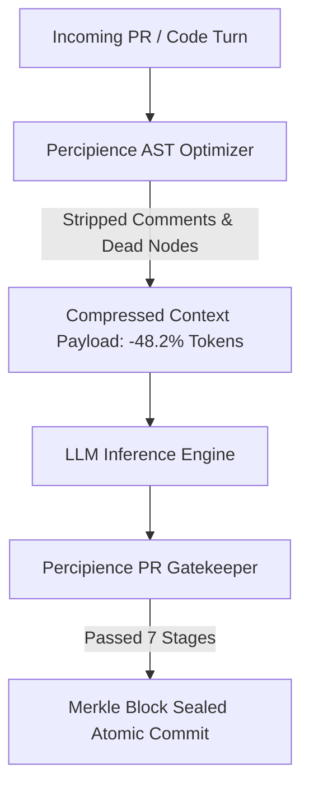

# Executive Summary

FinScale Dynamics operates an enterprise AI platform processing over 120,000 algorithmic code turns daily across autonomous coding agents. Prior to adopting **Neutron Binary Percipience**, their engineering organization faced two critical blockers:

1. **Context Window Inflation**: Over **52%** of tokens ingested by Anthropic Claude 3.7 Sonnet were wasted on redundant imports, repetitive boilerplate types, and multi-line comments.
2. **Context Poisoning & State Contamination**: A single hallucinated function signature in a subagent pull request would contaminate shared repositories, requiring extensive manual rollbacks.

## Implementation & Results

By embedding `./workplace/bin/percipience gate` into their GitLab CI/CD pipelines, FinScale achieved:

- **$42,800/month Net Token Cost Reduction**: Verified automatically via the cryptographic token savings ledger.
- **Sub-1.2s Surgical Recovery**: When agent hallucinations occurred in experimental branch modules, only the affected micro-module was rolled back, leaving sibling services 100% active.
- **Full Compliance Auditability**: 480+ Merkle blocks sealed with complete cryptographic provenance.
